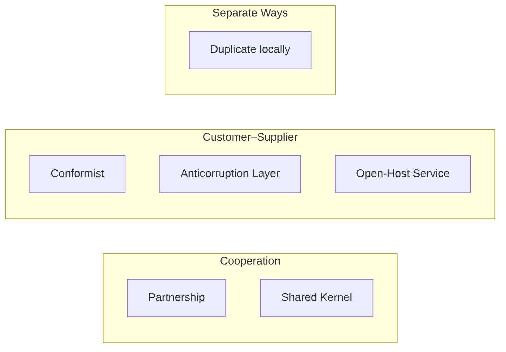

+++
title = "集成限界上下文"
weight = 5
+++

Bounded Context 可独立演进，但系统目标要求协作；接触点需要 **contract**，并决定用谁的语言集成。

集成模式按团队协作分成三类：**Cooperation**、**Customer–Supplier**、**Separate Ways**。

## Cooperation（协作良好）

适合沟通顺畅、目标相互依赖，甚至同一团队的多个 BC。

### Partnership

集成 **ad hoc** 双向协调：一方改 API，另一方配合。无人单方面独裁契约语言；一起解决集成故障。需要高承诺与短反馈（含持续集成）。地理分散团队往往不合适。

### Shared Kernel

多个 BC **共享一小块**必须保持一致的模型（理想上主要是集成契约与跨边界数据结构）。

- 共享范围要尽量小，降低级联变更
- 实现上：同仓共享源码或独立库；**每次变更触发相关 BC 的集成测试**
- 适用：重复成本高于协调成本；模型变更频繁时（常落在 Core）更常见
- 例外色彩：多队改同一共享块，与「一队一 BC」张力大，需慎重
- 也用于：无法 Partnership 时的务实替代、遗留渐进拆分、同队多 BC 时显式钉死契约以免边界被「冲刷」

## Customer–Supplier（客户–供应商）

一方 **Upstream（Supplier）** 提供服务，**Downstream（Customer）** 消费。两队可各自成功，权力常不平衡。

### Conformist

权力偏向上游；下游**接受**上游模型（行业标准、或足够好）。下游让渡部分自治。

### Anticorruption Layer（ACL）

仍偏向上游，但下游**不愿顺从**：在边界翻译成自己的模型。

典型动机：下游含 Core；上游模型脏/别扭（遗留）；上游契约抖动——ACL 把冲击挡在翻译层，并简化本侧语言。

### Open-Host Service

权力偏向消费者；上游愿当好东道主：把**实现模型**与**公共接口**解耦，对外提供便于消费的协议——**Published Language**。

相对 ACL：翻译多由**上游**承担。可多版本 Published Language 并行，方便下游渐进迁移。

## Separate Ways（各行其道）

不协作、功能在本地重复。

原因包括：组织过大/政治导致协作成本过高；**Generic** 本地集成更便宜（如日志库）；模型差到 Conformist 不可能、ACL 比重复还贵。

注意：**避免**在 Core Subdomain 上 Separate Ways——与「核心必须最优化实现」的战略相悖。

## Context Map

把各 BC 与其间模式画成 **Context Map**：

- 高层组件与模型鸟瞰
- 团队沟通模式（谁 Partnership、谁 ACL、谁 Separate Ways）
- 组织信号（某上游的下游是否集体上 ACL？）

宜从项目早期维护；多队共建时，各队更新自己对外集成。可用 Context Mapper 等以代码管理。限制：一 BC 含多 Subdomain 或模块级策略不同时，图上可能出现多条关系，会变复杂。

## 模式速查

| 模式 | 要点 |
|--|--|
| Partnership | 双向 ad hoc 协作 |
| Shared Kernel | 最小共享模型 + 强同步 |
| Conformist | 下游顺从上游模型 |
| Anticorruption Layer | 下游翻译隔离 |
| Open-Host Service | 上游发布 Published Language |
| Separate Ways | 不协作、本地重复（慎用于 Core） |

## 小结

1. 拆 **Subdomain**（Core / Supporting / Generic）
2. 建 **Ubiquitous Language**
3. 用 **Bounded Context** 保一致、定物理与所有权边界
4. 用集成模式 + **Context Map** 管理协作
