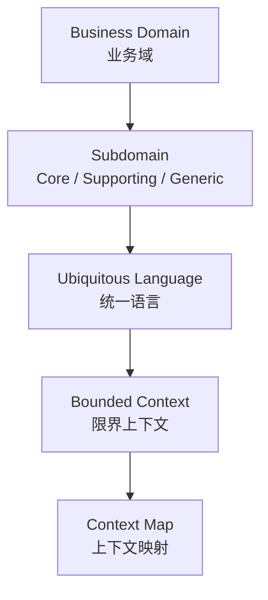

+++
title = "Strategic Design"
book_title = "战略设计"
weight = 1
final = true
+++

Strategic Design 关心 *what* 与 *why*：要建什么软件、为何而建。

从业务结构走到协作边界：先分清 **Business Domain** 与 **Subdomain**，用 **Ubiquitous Language** 对齐理解，用 **Bounded Context** 限定模型范围，再用集成模式与 **Context Map** 描述上下文之间如何协作。

