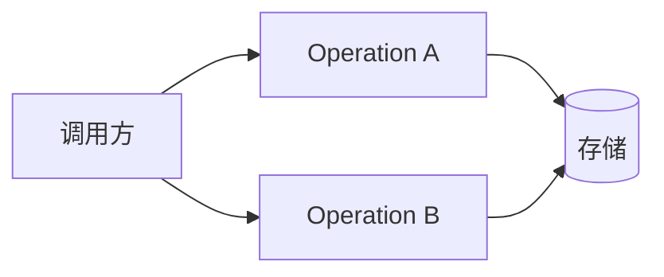
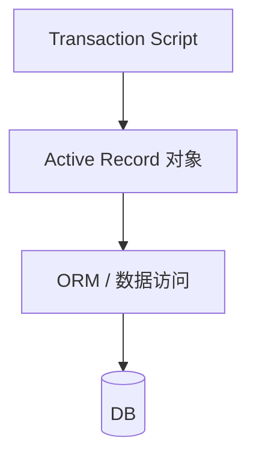

+++
title = "简单业务逻辑"
weight = 2
+++

业务逻辑是软件存在的理由。不同 Subdomain 复杂度不同：本章两个模式面向**相对简单**的逻辑——**Transaction Script** 与 **Active Record**。

## Transaction Script

把系统公共接口看成一组业务事务：查询、修改或两者兼有。模式按**过程**组织逻辑，每个过程对应消费者触发的一次操作，用操作本身做封装边界。

### 实现要点：事务语义

过程可以直连数据库，也可以经薄抽象层；**硬性要求**是事务行为——成功或失败，不能停在非法中间态（回滚或补偿）。

名字里的 *transaction* 强调的是这点，不是「写法高级」。

### 看起来简单，最容易做错

原书强调：Transaction Script 是后续更复杂模式的基础；生产事故常可归结为事务语义没做对。典型坑：

1. **无总控事务**
   连续两次写（更新 Users + 插入 VisitsLog），中间失败 → 半更新。关系库上用同一本地事务包住即可。

2. **显式分布式事务**
   写库后再发消息总线。库成功、消息失败 → 状态与通知不一致。真分布式事务难扩展、易错，通常回避；后文用 **CQRS**、**Outbox** 等手段可靠投递。

3. **隐式分布式事务**
   只更新一行计数器，仍在向**调用方**传达成败。若更新成功但响应丢失，调用方重试 → 计数 +2。缓解：幂等（调用方传目标值）、乐观并发（带期望版本/期望计数再 `UPDATE … WHERE`）。

### 何时使用

- 逻辑像过程式流水线，尤其 **ETL**（抽取—转换—装载）
- **Supporting Subdomain**（定义上就简单）
- 对接外部系统的适配、**Anticorruption Layer** 的一部分

**不要**用于 Core：规则一复杂，过程脚本会复制逻辑、行为不一致，滑向大泥球。简单是优点也是上限。

## Active Record

逻辑仍简单，但操作的数据结构更复杂（对象树、一对多等）。若仍用纯 Transaction Script 手写映射，重复会爆。

**Active Record**：对象既表示数据结构，又带创建/读/更新/删除等数据访问；常与 ORM 耦合——结构是「活」的。

业务仍可用 Transaction Script 编排，但操作的是 Active Record，结束时仍要**原子提交**：

### 何时使用

数据形状复杂、规则仍浅（多为校验与简单转换）。比裸 SQL 脚本少重复；一旦规则缠成网，应升到 **Domain Model**，而不是在 Active Record 上堆行为。

## 小结

| 模式 | 适合 | 警惕 |
|--|--|--|
| Transaction Script | 简单过程、Supporting、ETL | 事务语义；勿用于 Core |
| Active Record | 数据复杂、规则仍简单 | 别把复杂不变式塞进 CRUD 对象 |

下一篇：规则与不变量真正复杂时的 **Domain Model**。
