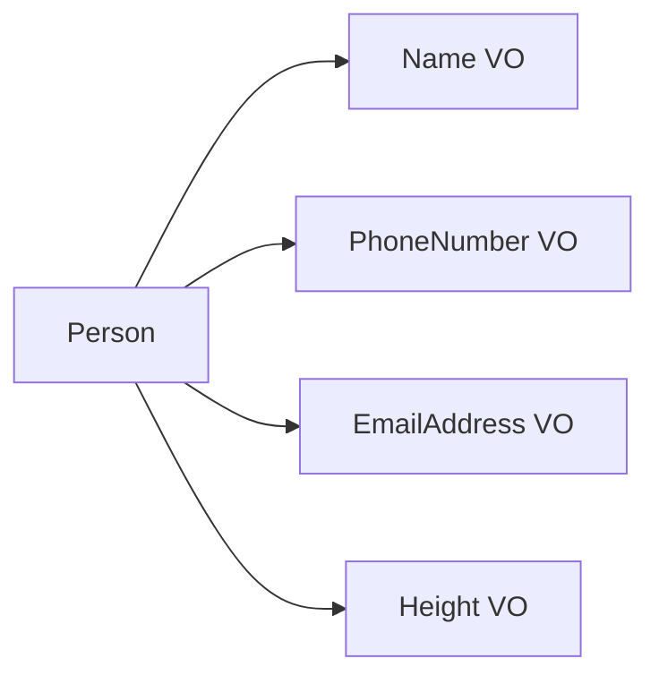
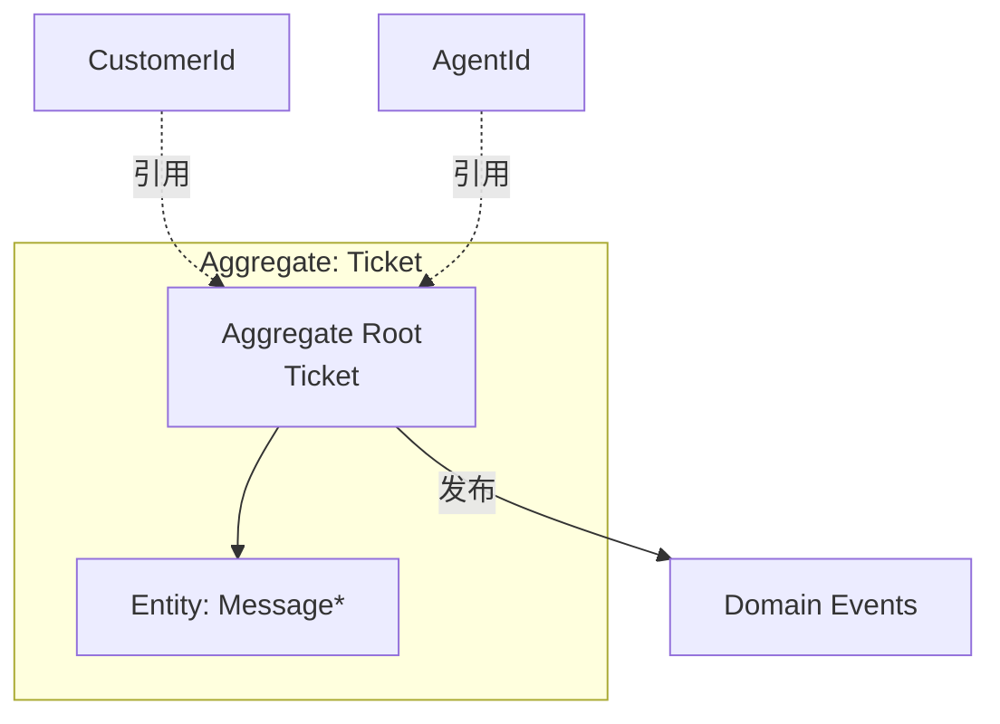

+++
title = "复杂业务逻辑 · Domain Model"
weight = 3
+++

规则缠成网、状态迁移与不变量必须始终成立时，CRUD / Active Record 容易复制逻辑、破坏一致性。这时用 **Domain Model**：对象同时承载数据与行为，并让代码说 Ubiquitous Language。

> 书中称 Fowler 的 *domain model*；Evans 的 Aggregate、Value Object 等是其积木。作者刻意保留 Fowler 用语，避免「做 DDD = 必须上战术模式」的误解。

## 问题形态（工单例子）

工单优先级、SLA、升级缩短时限、未读则自动改派、超时关闭、升级单不能随便关、关闭后限时重开……条件互相牵扯。这不是表单录入，是**一致性敏感的状态机 + 规则集**。

## 设计原则

- **业务优先**：模型对象是普通领域对象，不直接掺数据库/框架调用（避免事故复杂度叠在领域复杂度上）。
- **语言对齐**：命名与结构跟随 Bounded Context 的 Ubiquitous Language。

## Value Object

由属性组合标识；改任一字段在概念上就是**另一个值**。不必（也不该）再加多余 Id（例如两个 RGB 相同却 ColorId 不同）。

对抗 **Primitive Obsession**：别用一堆 `string`/`int` + 约定表示电话、邮箱、国家码——校验分散、易漏。改用 `PhoneNumber`、`EmailAddress`、`CountryCode` 等 VO：意图清晰，校验与行为内聚，可测。

实现：**不可变**；产生新值就返回新实例（如 `Color.MixWith`）；正确实现相等与哈希。金额等更要 VO，避免精度与舍入陷阱。

经验：能用 VO 就用；尤其描述**实体属性**的概念。

## Entity

需要显式身份区分实例（两个同名的人不是同一人）；状态可变。身份本身常用 VO（`PersonId`）。
在 Domain Model 落地时，实体通常出现在 **Aggregate** 内部，而不是独立「满天飞」的实体服务。

## Aggregate

聚合是实体，但目标是**保护一致性**：

- 边界外只能读状态；修改只能走聚合命令（方法或 Command 对象）。
- 命令负责校验规则与不变量；相关业务逻辑集中在聚合内。
- **事务边界**：一次提交只改**一个聚合实例**；需要「多聚合同一本地事务」往往说明边界划错。
- **尽量小**：只有业务要求强一致的数据进聚合；可最终一致的放到外，用 Id 引用其他聚合。
- **Aggregate Root**：层次中唯一对外入口；改内部实体也经由根（如经 `Ticket` 标记某条 `Message` 已读）。

应用层很薄：加载 → 执行命令 → 保存；用版本号/乐观并发防止后写覆盖先写。

文档库常更贴聚合形状；关键是存储必须支持并发控制。

## Domain Event

描述已发生的事实（过去时）：`TicketEscalated`、`MessageReceived`… 带齐订阅方需要的数据。
属于聚合公共接口的一部分：聚合发布，其他过程/聚合/外部系统订阅后各自反应。

## Domain Service

领域里放不进单一实体/聚合的操作（例如需**读取**多个聚合才能算的结果）。
**禁止**借 Domain Service 在一次事务里改多个聚合——那条「一实例一事务」仍然成立。

## 小结

| 构件 | 抓住什么 |
|--|--|
| Value Object | 不可变、值相等、表达属性与行为 |
| Aggregate | 一致性与事务边界、尽量小、一根对外 |
| Domain Event | 已发生事实、驱动后续反应 |
| Domain Service | 跨聚合领域能力，不破事务边界 |

状态「当前长什么样」不够、还要「一路怎么过来的」时，见下一篇 **Event Sourcing**。
