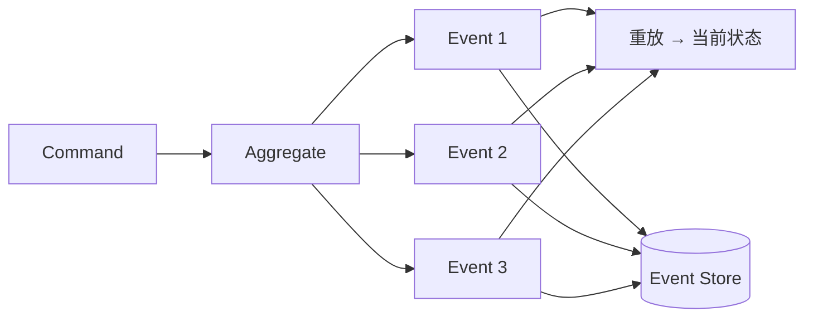

+++
title = "时间维度 · Event Sourcing"
weight = 4
+++

传统持久化多存**当前状态**：更新一行，历史被覆盖。若业务要审计、追责、按时间线分析「中间发生了什么」，需要显式建模时间——**Event Sourcing（事件溯源）**。

## 核心想法

聚合的每次变更都表达为一系列 **Domain Event**；事件流是真相来源（source of truth）。当前状态 = 从空状态（或快照）重放事件的结果。

对比状态模型：表里一行 `lead` 的 `status=Won` 告诉你现在，却很难还原谈判中的关键转折；事件序列可以。

## 为何有用

- **审计与合规**：要的是不可抵赖的「发生过什么」
- **业务洞察**：优化流程需要时间线，而不只是最终快照
- **时点调试**：重放可复现决策上下文

## 设计要点

- 事件与 Domain Model 中的 Domain Event 一脉相承；载荷多用 **Value Object** 描述事实细节。
- 写入新事件时仍要处理并发：他人可能已追加事件——需按业务判断冲突或可合并。
- **不要**把 Value Object「改造成事件溯源聚合」；VO 仍描述属性，ES 改变的是聚合状态的存储与演化方式。

## 代价

- 架构零件更多（存储、重放、投影、订阅）
- 按「当前状态字段」做任意查询不自然 → 常配 **CQRS** 投影读模型
- 团队心智负担上升；仅在洞察/审计价值撑得起复杂度时采用

## 小结

Event Sourcing 用事件序列建模时间维度，适合强审计与深洞察的 Core；简单 CRUD 域不必上。下一篇：上下文内如何摆业务与基础设施——**Layered / Ports & Adapters / CQRS**。
