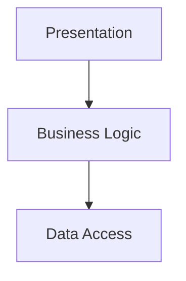
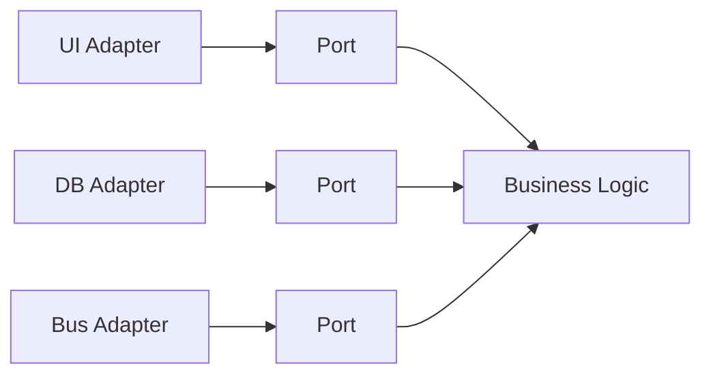
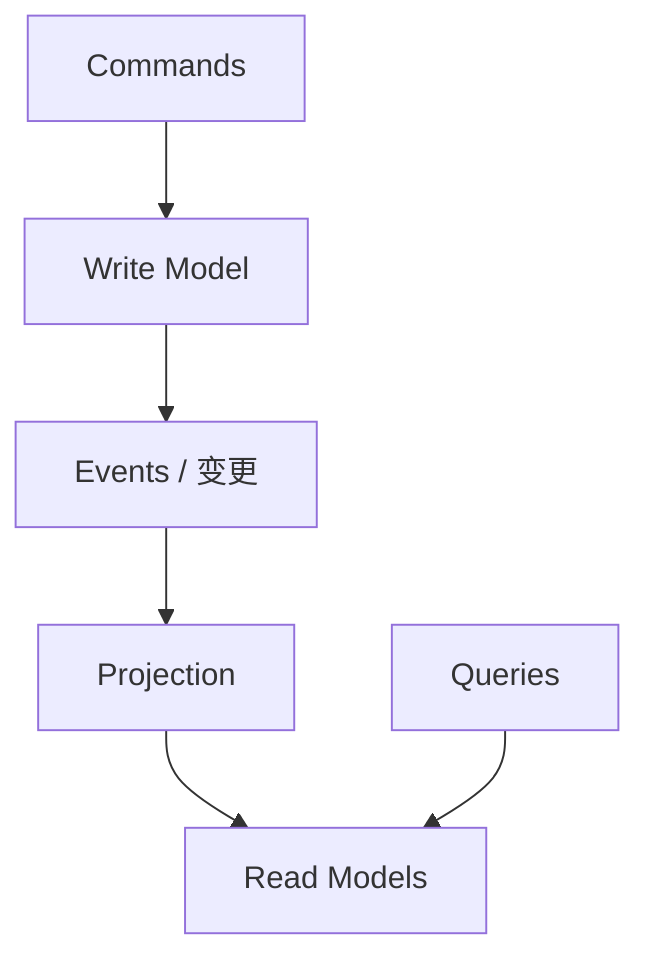

+++
title = "架构模式"
weight = 5
+++

架构模式规定代码如何按职责切块，以及业务逻辑如何接到输入、输出与基础设施。粒度常是 **Bounded Context 内**（甚至其中某个 Subdomain），不必强行全系统一种架构。

## Layered Architecture

横向分层，经典为：

- **Presentation**：触发行为的一切（UI、HTTP、消息消费等）
- **Business Logic**：业务规则
- **Data Access**：持久化

业务层依赖数据访问时，很适合 **Transaction Script / Active Record**。
**Domain Model** 吃亏：聚合不应依赖底层存储细节，经典分层容易把基础设施渗进模型。

层（逻辑边界）≠ Tier（物理部署）；别把 N-Tier 拓扑和分层代码组织混为一谈。

## Ports & Adapters

把「表现 + 数据访问」都看成与外部世界的集成，合成基础设施侧；**业务在中心**。

依赖倒置：高层业务不依赖低层技术细节；技术通过 **Port（端口）** 接入，由 **Adapter（适配器）** 实现。

适合 **Domain Model**：模型不谈框架，测试可替换适配器。云厂商消息总线等集成落在基础设施/适配器侧，不进领域内核。

## CQRS

同一业务数据用**不同模型**服务不同用途：

- **Command**：改状态、执行不变式（写模型，常即 Domain Model / ES）
- **Query**：面向读取的专用模型（可另一数据库）

投影类似物化视图：源变更后同步或异步刷新读侧。
**Event Sourcing** 几乎必然搭配 CQRS（事件不好直接当任意查询表用）。
非 ES 系统只要「多模型、多存储、读写负载分离」也可以用 CQRS。

## 范围提醒

一个 Bounded Context 内可有多种 Subdomain，**可以**对 Supporting 用分层 + Active Record，对 Core 用 Ports & Adapters + Domain Model——按问题选刀，而不是一刀切。

## 小结

| 模式 | 适合 |
|--|--|
| Layered | 简单逻辑、TS/AR |
| Ports & Adapters | Domain Model、要测要隔离 |
| CQRS | 多读模型、ES、读写分离 |

下一篇：组件之间如何可靠发消息、编排跨聚合流程。
