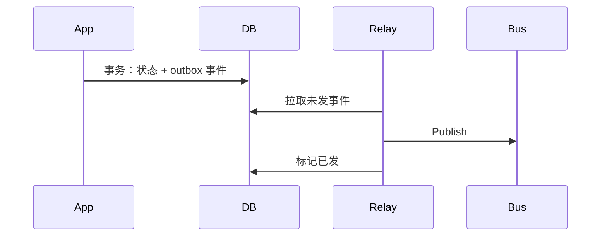
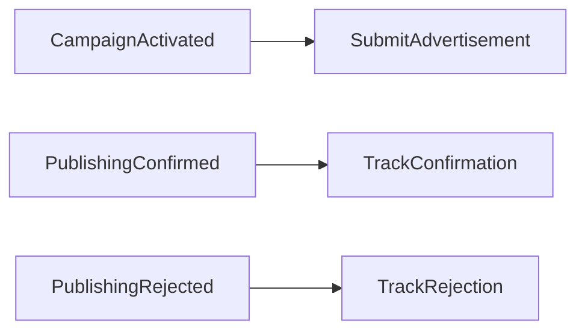
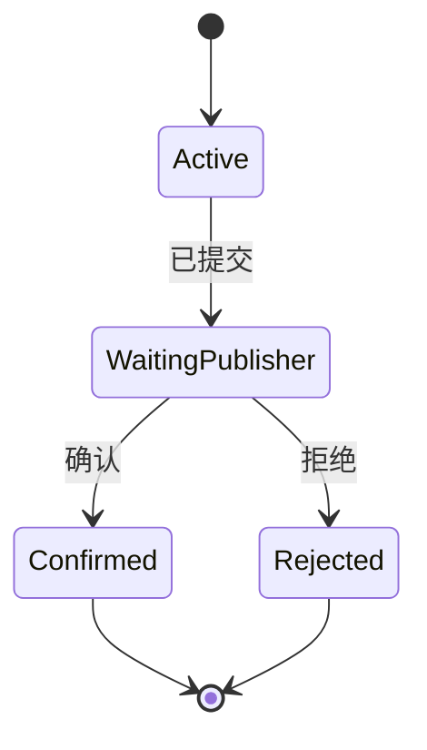

+++
title = "通信模式"
weight = 6
+++

Bounded Context 要协作：翻译模型、可靠发布事件、编排跨事务流程。本章补齐实现侧常用模式。

## 模型翻译与 ACL

战略篇的 **Anticorruption Layer** 在实现上常是同步或异步的转换代理（含 API Gateway 形态）。多下游共用同一翻译时，翻译本身可成为集成向的 Bounded Context。

Open-Host 侧则是上游维护 **Published Language**；细节随同步/异步而变，目标都是隔离「外国模型」。

## Outbox：可靠发布

问题：写库成功但发消息失败（或相反）→ 状态与通知分裂。

**Outbox**：

1. 同一原子事务提交：聚合新状态 + 待发 Domain Event（关系库可用 Outbox 表；无多文档事务的 NoSQL 可把事件嵌进聚合文档）。
2. 中继进程读出未发事件，发到消息总线。
3. 成功后标记已发或删除。

这样「库已提交」蕴含「消息终将被投递」（至少到 Outbox 语义下的尽力可靠）。

## Saga

聚合原则：一次事务一个实例。跨多个业务实体的流程不能塞进一个大聚合。

**Saga**：跨多个事务的长流程（时间可短可长）。常见实现是订阅事件并映射为下一步命令，流程相对**线性**。

例：活动激活 → 提交素材给发布方 → 确认/拒绝后再回写活动。

## Process Manager

Saga 擅长简单事件→命令映射。流程有分支、要按状态做决策时，用 **Process Manager**：中央单元保持流程状态，根据业务逻辑选择下一步（更「有脑子」的编排）。

两者都依赖异步消息；和 Outbox 常一起出现，保证编排所依赖的事件真的发出去。

## 小结

| 模式 | 解决什么 |
|--|--|
| ACL / 翻译 | 模型阻抗 |
| Outbox | 改状态与发消息的原子性缺口 |
| Saga | 线性跨事务流程 |
| Process Manager | 有状态、有分支的复杂流程 |

战术篇到此：逻辑模式 → 架构 → 通信。实践中如何选、如何演化，见「应用 DDD」部分。
