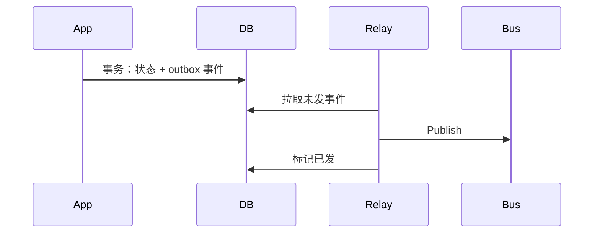
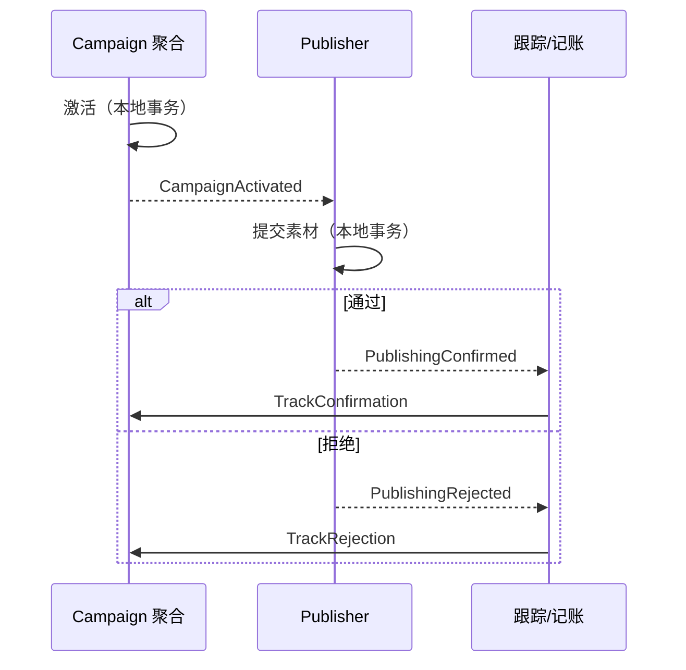
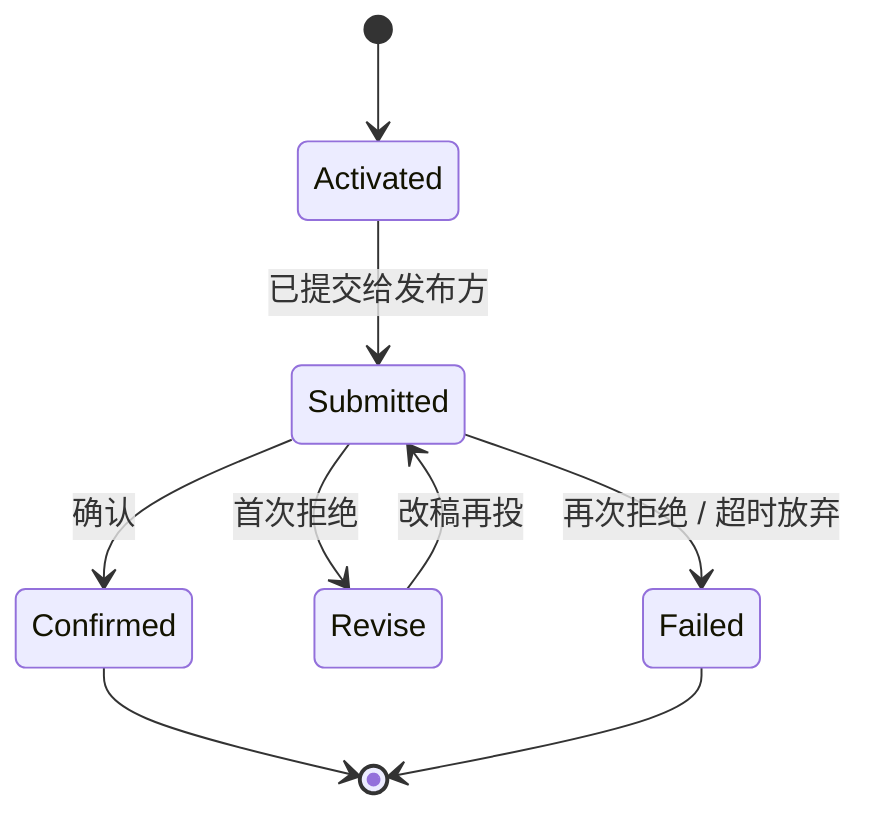
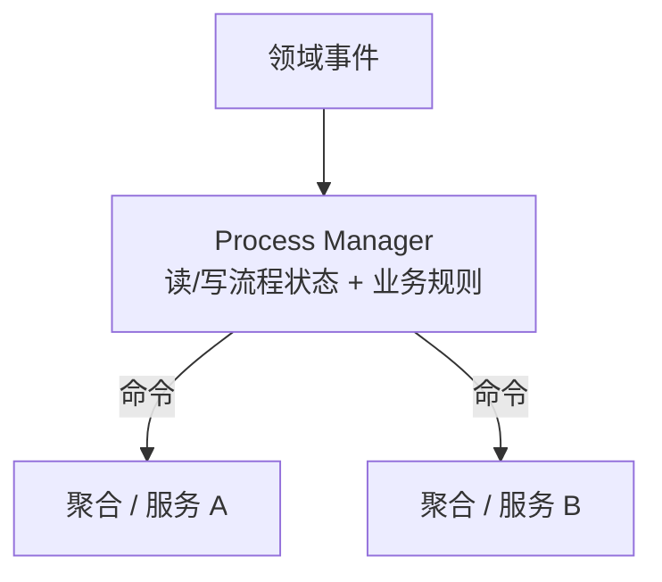

+++
title = "通信模式"
weight = 6
+++

Bounded Context 要协作：翻译模型、可靠发布事件、编排跨事务流程。本章补齐实现侧常用模式。

## 模型翻译与 ACL

战略篇的 **Anticorruption Layer** 在实现上常是同步或异步的转换代理（含 API Gateway 形态）。多下游共用同一翻译时，翻译本身可成为集成向的 Bounded Context。

Open-Host 侧则是上游维护 **Published Language**；细节随同步/异步而变，目标都是隔离「外国模型」。

## Outbox：可靠发布

问题：写库成功但发消息失败（或相反）→ 状态与通知分裂。

**Outbox**：

1. 同一原子事务提交：聚合新状态 + 待发 Domain Event（关系库可用 Outbox 表；无多文档事务的 NoSQL 可把事件嵌进聚合文档）。
2. 中继进程读出未发事件，发到消息总线。
3. 成功后标记已发或删除。

这样「库已提交」蕴含「消息终将被投递」（至少到 Outbox 语义下的尽力可靠）。

## 跨事务流程：为何需要 Saga / Process Manager

聚合原则：**一次数据库事务只改一个聚合实例**。下单→扣库存→收款→发货这类流程却跨多个聚合（甚至多个 Bounded Context），不能做成一个大事务、也不能揉成一个巨型聚合。

做法：拆成多步本地事务，用异步消息串起来；某步失败则发**补偿**（业务上的撤销/冲正），而不是两阶段提交。

下面两种模式都干这件事，差别在「编排有多聪明」。

## Saga：简单的事件 → 命令接力

**Saga**：跨多个本地事务的长业务流程（时间可短可长）。

书里强调的简单形态：订阅方看到事件 A，就发出命令 B——像一张**对照表**，流程大体线性，编排逻辑分散在各步。

广告活动例子：

| 收到事件 | 发出命令 |
|--|--|
| CampaignActivated | SubmitAdvertisement（把素材交给发布方） |
| PublishingConfirmed | TrackConfirmation（活动侧记成功） |
| PublishingRejected | TrackRejection（活动侧记失败） |

适合：步骤少、路径直、下一步几乎由「刚发生的事件」唯一决定。

## Process Manager：有状态的流程总指挥

当流程要记进度、有多条出路、或「同一种事件在不同阶段含义不同」时，一张事件→命令表不够用。

**Process Manager**：独立的流程组件，为**每次进行中的业务过程**保存状态（状态机/流程实例），集中决定下一步发什么命令。

还是广告活动，但加上规则：首次拒绝可改稿再投，第二次拒绝才彻底失败；超时未响应要催办——这些都依赖「当前是第几次、是否已催过」等**流程状态**。

适合：分支多、要策略/重试/人工介入、下一步取决于「历史走到哪」而不只是「刚收到什么事件」。

## 怎么选（对照）

| | Saga（简单形态） | Process Manager |
|--|--|--|
| 心智模型 | 事件→命令的接力表 | 流程实例 + 状态机 |
| 状态 | 多在各业务聚合里 | **额外**持有流程进度 |
| 路径 | 近似线性 | 分支、循环、超时 |
| 决策在哪 | 分散在各订阅方 | 集中在管理器 |
| 复杂度 | 低 | 较高，但复杂流程更清晰 |

业界有时把「编排式长事务」也统称 Saga；本书把「简单映射」叫 Saga，把「有状态决策」叫 Process Manager——读其他资料时注意用词可能混用。

两者都依赖可靠异步消息；和 **Outbox** 常一起用，避免「库已改、事件没出去」导致流程卡死。

## 小结

| 模式 | 解决什么 |
|--|--|
| ACL / 翻译 | 模型阻抗 |
| Outbox | 改状态与发消息的原子性缺口 |
| Saga | 线性、表驱动的跨事务接力 |
| Process Manager | 有状态、有分支的跨事务编排 |
