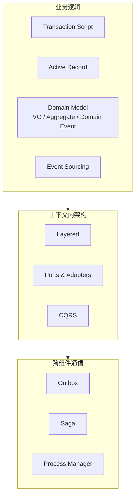

+++
title = "Tactical Design"
book_title = "战术设计"
weight = 2
+++

Tactical Design 关心 *how*：在 Bounded Context 内如何实现业务逻辑、组织代码、可靠地协作。

选型直觉：逻辑简单 → Transaction Script / Active Record；逻辑复杂 → Domain Model（必要时 Event Sourcing）；架构随逻辑复杂度与查询需求升级；跨聚合流程用 Saga / Process Manager，发消息用 Outbox。

1. [名词介绍]()
2. [简单业务逻辑]()
3. [复杂业务逻辑 · Domain Model]()
4. [时间维度 · Event Sourcing]()
5. [架构模式]()
6. [通信模式]()
