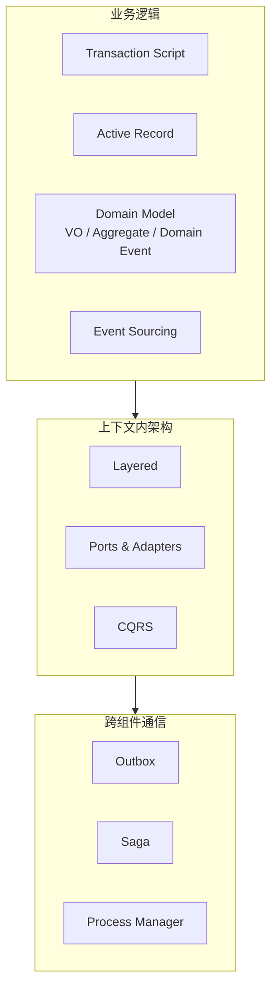

+++
title = "Tactical Design"
book_title = "战术设计"
weight = 2
final = true
+++

Tactical Design 关心 *how*：在 Bounded Context 内如何实现业务逻辑、组织代码、可靠地协作。

选型直觉：逻辑简单 → Transaction Script / Active Record；逻辑复杂 → Domain Model（必要时 Event Sourcing）；架构随逻辑复杂度与查询需求升级；跨聚合流程用 Saga / Process Manager，发消息用 Outbox。
