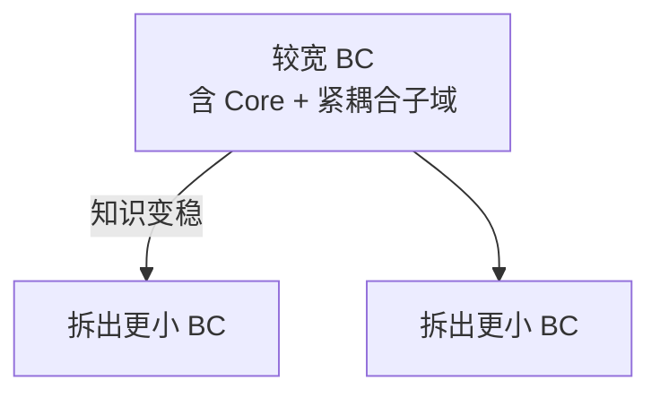
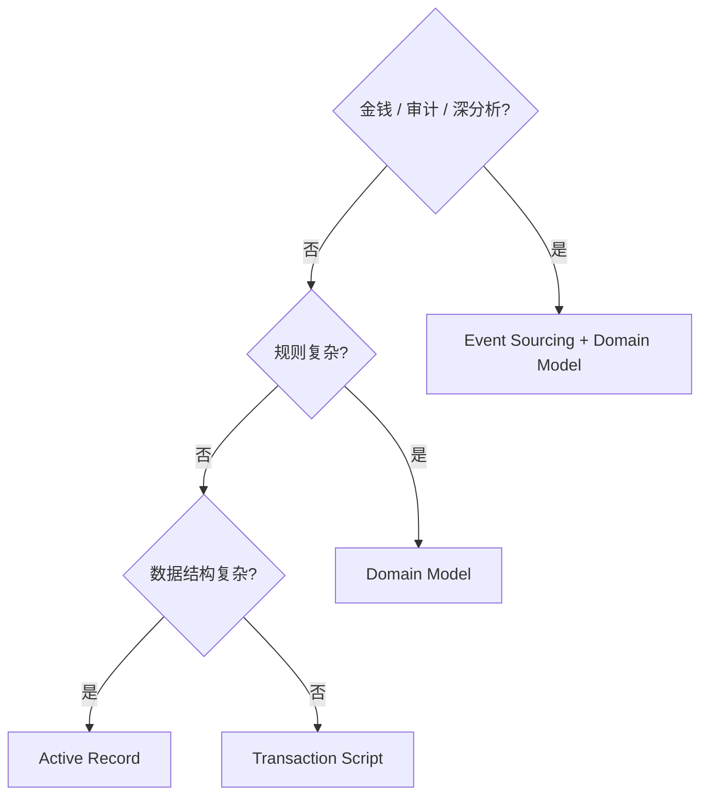

+++
title = "设计启发法"
weight = 1
+++

软件里几乎一切都是「看情况」——但要能落地，需要**启发法（heuristic）**：不保证数学完备，却抓住关键线索的经验规则。本章把 Part I 的业务判断接到 Part II 的技术选型。

## Bounded Context 大小

别用「尽量小」当第一原则。边界应服务模型，而不是反过来为微服务体量削足适履。

跨多个 Bounded Context 的频繁改动很贵；边界划错又难重构时，债务会堆着。早期 **Core** 波动大、不确定高 → 宜从**更宽**的上下文起步（可含与 Core 强互动的 Supporting / Generic），逻辑边界错了比物理拆错了好修；知识变清晰后再拆窄。

## 业务逻辑模式怎么选

按问题依次问：

1. 要管金钱/强制审计/深度行为分析？→ **Event-Sourced Domain Model**
2. 否则，业务规则复杂？→ **Domain Model**
3. 否则，数据结构复杂？→ **Active Record**
4. 否则 → **Transaction Script**

粗判复杂度：复杂 ≈ 纠缠的规则/不变量/算法；简单 ≈ 以校验输入为主。Ubiquitous Language 若满是 CRUD 动词，多半偏简单；若在讲流程与策略，偏复杂。

选型与「你以为的子域类型」不一致时，**回头质疑子域判断**（Core 优势也不一定是技术）。

## 架构怎么跟

| 逻辑模式 | 常见架构 |
|--|--|
| Event-Sourced Domain Model | **CQRS**（几乎必需） |
| Domain Model | **Ports & Adapters** |
| Active Record | Layered（常加 Application/Service 层编排） |
| Transaction Script | 精简 Layered |

例外：非 ES 只要需要多持久化读模型，也可以上 CQRS。

## 测试策略怎么跟

| 侧重 | 适合 |
|--|--|
| 测试金字塔（单元多） | Domain Model / ES（聚合、VO 是好单测单元） |
| 测试菱形（集成多） | Active Record（逻辑跨 service + 数据对象） |
| 倒金字塔（端到端多） | Transaction Script（层少、流程短） |

## 小结

启发法链路：**子域性质 → 逻辑模式 → 架构 → 测试重心**。下一篇：业务与组织一变，这些决策如何跟着演化。
