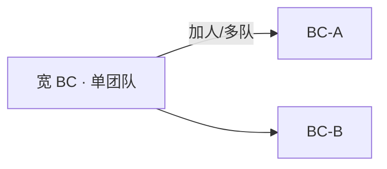
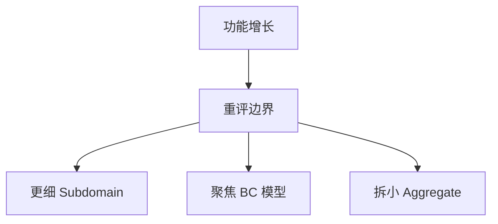

+++
title = "设计决策的演化"
weight = 2
+++

「唯一不变的是变化。」业务要竞争就会演化；设计必须把变化当一等公民，而不是一次性图纸。

## 子域会变类型

Supporting 可能商品化成 Generic；Core 可能被追平而贬值；新机会会长出新 Core。识别变化后，重新套启发法：该降配的别继续堆 Domain Model，该升配的别再 CRUD 硬撑。

## 组织与集成也会变

团队拆分、汇报线、地理分布一变，沟通成本变 → **Partnership / Shared Kernel / ACL** 等是否仍合适要重估。康威定律在此不是口号：协作结构会渗进 Context Map。

典型例子：开发中心扩张、加人 → 一个宽 Bounded Context 只能由一个团队拥有 → 常被迫**拆成更小上下文**，好让各队各有边界。

## 知识在加深

Core 的难，往往一开始是**隐性**的：起初一切显得简单，随后边角、不变量、规则涌现。建模是持续过程；早期偏宽的 Bounded Context，正是为后来「知情拆分」留余地。

## 增长要管

健康系统会持续加功能；不管的增长会吹破边界，变成大泥球（Foote & Yoder：无管制生长 + 权宜修补）。增长时要主动重评设计：

- 子域功能膨胀 → 寻找**更细的子域边界**，再谈模式
- Bounded Context 勿成「万事通」→ 模型应对准特定问题
- Aggregate 别图省事把新功能塞进旧根 → 保持「只含必须强一致的对象」；可抽出新聚合，顺带减少不必要的强一致与锁竞争

## 小结

演化清单：子域类型？边界是否仍保护模型？集成模式是否匹配团队？战术模式与聚合是否仍匹配复杂度？下一篇用 **EventStorming** 加速共享认知。
