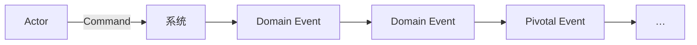

+++
title = "EventStorming"
weight = 3
+++

## EventStorming

低技术协作工作坊：一群人用便利贴在时间线上快速为业务流程建模。产出模型重要，更重要的是**对齐心智模型、迈向 Ubiquitous Language**。

## 谁参加 / 要什么

- 参与者尽量多元：工程师、Domain Expert、PO、测试、设计、支持……相关者都可；控制在约 **≤10 人** 以便人人能贡献。
- 场地：整面墙纸/大白板；多色便利贴；马克笔；零食；**尽量拿走椅子**——站着参与。

## 过程（常见十步，抓主干）

1. **无结构探索**：每人写橙色 Domain Event（**过去时**），先不排序、不怕重复。
2. **时间线**：先排 happy path，再补分支与错误路径。
3. **痛点**：瓶颈、手工、缺文档、缺知识——粉色菱形贴标出。
4. **枢轴事件（Pivotal Events）**：阶段切换的大事件（下单、发货、签收…）—常暗示 **Bounded Context** 候选边界。
5. **命令（Commands）**：谁/什么触发了事件。
6. **角色（Actors）**、**外部系统**、策略/读模型等按需叠加，直到故事讲得通。

（纸面颜色约定请跟团队/教材一致，便于对照资料。）

## 何时开

建语言、摸新域、找回失传知识、对齐多方对同一流程的理解——都合适。不必等「黑带」：组织起来，边做边学。

## 小结

EventStorming 是战术向的知识共享工具：事件时间线 + 痛点 + 枢轴边界。下一篇：棕地与组织未全盘 DDD 时怎么用这些工具。
