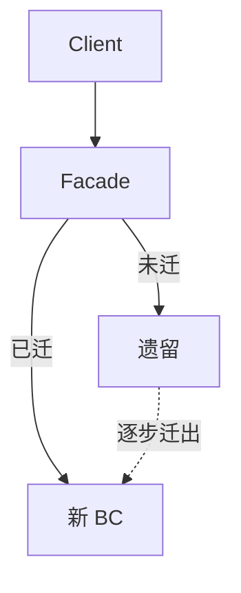

+++
title = "真实世界中的 DDD"
weight = 4
+++

绿田容易「按教科书」；现实多是棕地、遗留、团队未统一信奉 DDD。原则不变：**先从业务域分析开始**。

## 战略分析：先搞清业务与现状

先问清：

- 公司的 Business Domain、客户、提供的价值、对手是谁？
- 再 zoom in：支撑目标的 Subdomain 有哪些、类型如何？

初始启发可借组织架构与**已有软件边界**（模块、库、服务）反推子域，再按痛点与业务价值排序现代化——不是按技术新鲜感。

## 现代化：Think big, start small

大爆炸重写很少成功，管理层也很少买单。Eric Evans 说得好：大型系统不可能处处设计精良——要**战略性地选择投资点**。

边界不必一步到位成物理 Bounded Context：可先理清逻辑边界（命名空间/模块），让代码结构反映子域，再择机把逻辑边界变成物理边界。

### Strangler（绞杀榕）迁移

新上下文像绞杀榕：先落在宿主（遗留）之上，承接新需求并逐步迁功能；遗留侧尽量只做 hotfix，不再堆新能力。门面按迁移状态把流量导向新/旧。最终新系统盖住旧系统。

### 战术重构要渐进

- 不要从 Transaction Script / Active Record **一步跳到** Event-Sourced Domain Model。
- 中间站：**先做出状态型 Aggregate**，找准事务边界与相关逻辑内聚；再迁到 ES 会安全一个数量级。
- 同理，先 Domain Model，再视审计/洞察需要上 ES。

用 **EventStorming** 从无文档的泥球里**找回域知识**，重建 Ubiquitous Language，再决定哪段逻辑值得重建模。

## 组织未普及 DDD 时

仍可用模式背后的**逻辑**与同事沟通，不必先推销全套术语。工具服务于问题；术语服务于对齐。

## 小结

真实世界 DDD = 业务优先 + 渐进现代化（绞杀式）+ 战术小步 + 用原则说话。下一部分：与微服务、EDA、Data Mesh 的关系。
