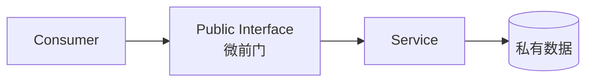
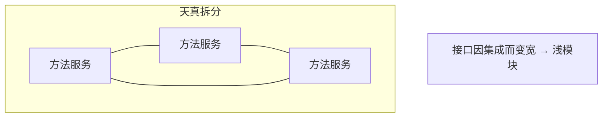
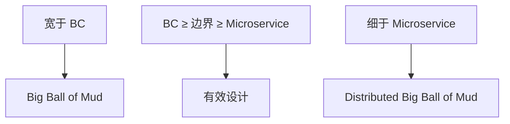

+++
title = "Microservices"
weight = 1
+++

微服务曾被当成银弹；许多拆分以「分布式大泥球」收场。它与 DDD（尤其 Bounded Context）历史纠缠，但**不是同义词**。

## Service

据 OASIS：Service 是经**约定公共接口**访问一组能力的机制。接口可以是同步请求/响应，也可以是异步生产/消费事件——凡进出数据的通道，都算「前门」。

Randy Shoup 把接口比作前门：进出都必须走门；接口本身就定义了服务对外暴露的能力。一份表达清晰的接口，足以说明服务做什么。

## Microservice

服务由公共接口定义，因此 **Microservice = 微公共接口（微前门）**。接口小 → 单服务职责易懂、变更理由少、更易独立演进/运维/伸缩。

这也解释了微服务**不暴露数据库**：把库当成前门的一部分，公共接口会膨胀到「任意 SQL 都算契约」——前门无穷大。

## 不是「一个方法一个服务」

把每个方法拆成独立服务，看似局部更简单，却要为跨库协作补大量集成接口——**局部复杂度↓，全局复杂度↑**，变成分布式泥球。

Glenford Myers 早已指出：不能只压本地复杂度，更要管**全局复杂度**（整体结构）。只优化其一是局部最优。

## Deep Module（深模块）

John Ousterhout 的深模块：接口相对简单、封装大量实现复杂度。微服务强调物理边界，深模块可逻辑可物理——设计原则一致。

- **深服务**：降低全局复杂度（复杂性关在门内）
- **浅服务**：门面很宽、封装很少 → 抬高全局复杂度

「不超过 X 行」「重写比改便宜」等定义，只盯单服务，忽略**系统**。拆到「微服务阈值」时，变更成本最低；再往下拆，服务变浅、接口因集成再变宽，变更成本回升 → 分布式大泥球。

## 与 Bounded Context

| | Microservice | Bounded Context |
|--|--|--|
| 本质 | **最小**合理服务边界 | 保护模型一致性的**最宽**有效边界 |
| 物理性 | 物理部署边界 | 也常是物理边界；可同进程多模块 |
| 团队 | 通常单团队拥有 | 通常单团队拥有 |
| 模型 | 不能塞冲突模型 | 不能塞冲突模型 |

结论：

- **凡微服务都是 Bounded Context**
- **Bounded Context 不必都是微服务**（可在宽边界内含多子域，按组织/生命周期再拆）

比上下文更宽 → 大泥球；比微服务更碎 → 分布式大泥球。中间地带才是安全设计空间。

## 拆分启发：优先对齐 Subdomain

- **Aggregate 当服务**：偶有合适，多数时候过碎——聚合与同子域其他对象耦合强时，单独成服务会变浅。
- **Subdomain 当服务**：更稳的默认启发——子域是细粒度业务能力、「做什么」而非「怎么做」；用例内聚、数据与模型相近、变更常一起发生 → 天然深模块。
- 例外：留在更宽的语言边界（整个 BC），或因非功能需求把某个 Aggregate 独立出去——取决于域、组织、战略、NFR；并随环境持续调整（见演化章）。

## 用战略模式「压薄」接口

- **Open-Host Service + Published Language**：集成模型与实现模型分离，消费者不绑死内部模型。
- **Anticorruption Layer**：可落在下游，也可作为独立翻译服务，避免把脏模型拖进自己的前门。

## 小结

微服务是部署/接口粒度策略；Bounded Context 是模型完整性策略。用 DDD 先定语言与子域边界，再决定哪些上下文值得独立部署；追求深模块，而不是追求「够碎」。
