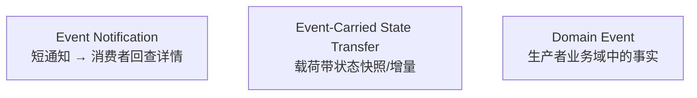
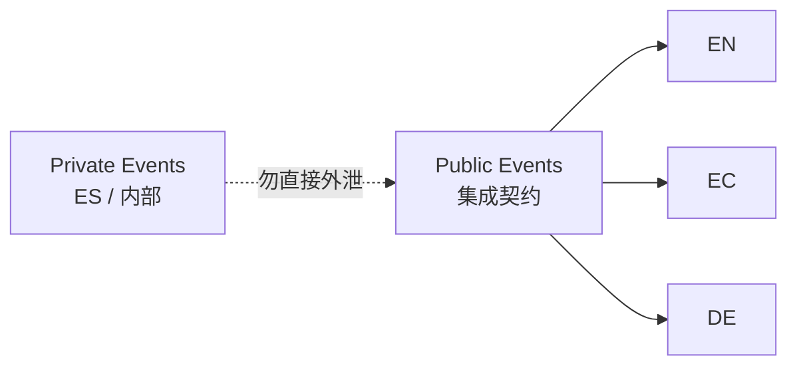

+++
title = "Event-Driven Architecture"
weight = 2
+++

## Event-Driven Architecture

**Event-Driven Architecture（EDA）**：组件靠异步**事件消息**协作，而不是默认同步 RPC。Saga 是典型事件驱动流程。

事件不是浇在遗留系统上就能变松耦合的「魔法酱」；滥用 EDA 同样能把模块化单体拖成**分布式大泥球**。

## EDA ≠ Event Sourcing

| | EDA | Event Sourcing |
|--|--|--|
| 位置 | 服务**之间**的通信风格 | 服务**内部**如何存状态 |
| 事件意图 | 跨边界集成 | 记录聚合状态迁移 |
| 公开性 | 常属公共接口的一部分 | 默认私有实现细节 |

把 ES 内部事件一股脑当集成契约，常常泄漏实现细节。

## Event / Command / Message

消息有两类：

| | Event | Command |
|--|--|--|
| 含义 | **已发生**的变化 | **请执行**的操作 |
| 拒绝 | 不能取消「已发生」 | 可因规则/校验拒绝 |
| 命名 | 过去时 | 祈使/动词 |

二者都可异步投递。补偿用新的 Command（如 Saga），不是假装事件没发生。

## 三种集成事件

### Event Notification

只通知「发生了重要之事」，详情由消费者再查（类似紧急短信：短、催你去别处看详情）。

适合场景：

- **安全**：敏感数据不进消息总线；查询时可再鉴权
- **并发/竞态**：异步到达时载荷可能已过期；显式查询拿最新；还可配合悲观锁保证「只有一个消费者处理」

代价：额外查询、生产者可用性依赖、授权设计。

### Event-Carried State Transfer（ECST）

通知状态变化，并携带**完整快照**或**仅变更字段**。概念上是异步数据复制：消费者可维持本地缓存，生产者短暂不可用时仍可工作；多源聚合读也少几次跨服务查询（如 BFF）。

注意：新鲜度、版本、与生产者模型的耦合。

### Domain Event（用于集成时）

描述生产者业务域中的重要事实；载荷自洽，消费者不必再查。与 Notification 的差别不在「有没有数据」，而在**建模意图**：Domain Event 首先服务域模型（哪怕暂时无人订阅）；Notification 首先服务集成。

与 ECST 的差别：Domain Event 讲的是**业务事实**，不是「把实体状态复制出去」的复制协议——尽管载荷上可能相似。

Event Sourcing 里的内部事件 ≠ 自动等于对外 Domain Event；对外要有意识地设计。

## 选错类型如何变成泥球

反例（书中 CRM → Marketing / AdsOptimization / Reporting）：

- 下游直接订阅生产者 **ES 内部 Domain Event** 自己投影 → **功能耦合**（多家投出同一扁平客户模型，逻辑重复）
- Reporting 依赖 AdsOptimization 先算完，用「延迟 5 分钟」硬凑顺序 → **时间耦合**（延迟挡不住过载、网络抖动、宕机）

正确方向：按一致性需求与是否暴露实现，选择 Notification / ECST / 显式公共 Domain Event；**公共事件 vs 私有事件**分清；投递用 Outbox 等保证「改成功则终将发出」。

## 小结

EDA 是异步集成风格，事件类型要刻意选择。下一篇：分析数据侧的 Data Mesh——同一套「边界 + 公共接口」思路。
