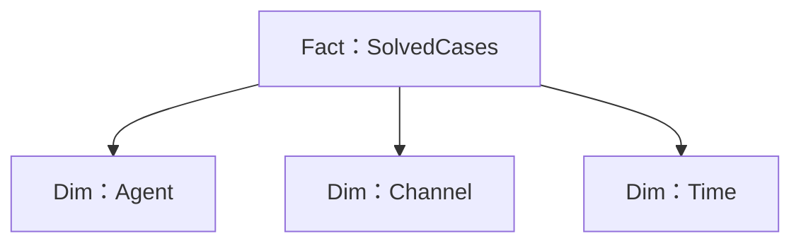
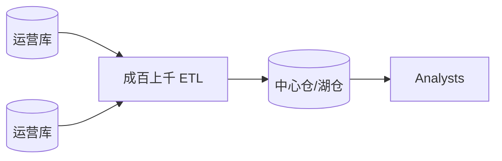
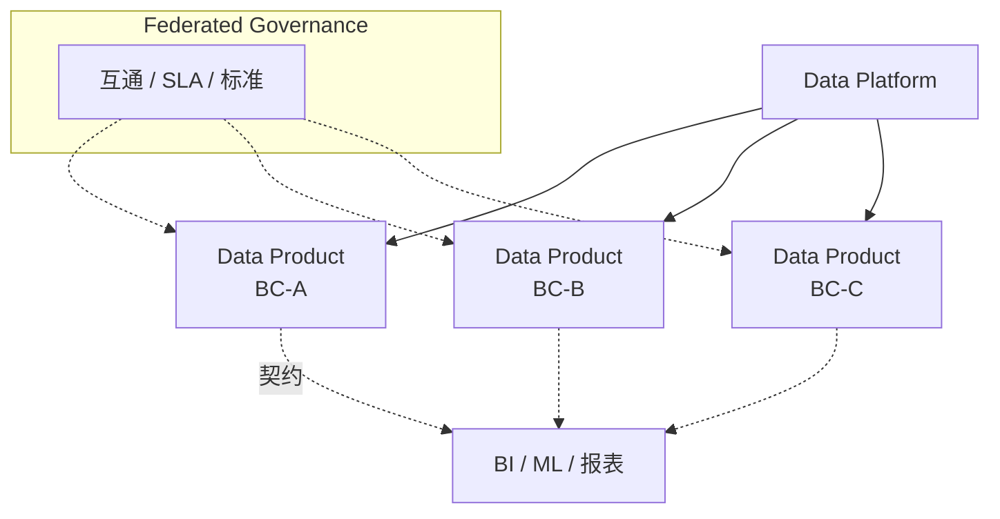

+++
title = "Data Mesh"
weight = 3
+++

前面多谈 **OLTP**（在线事务）：实体生命周期、实时编排。组织还需要 **OLAP**（在线分析）：洞察、优化、甚至训练模型。两者消费者不同、用例不同，**不能直接复用运营模型当分析模型**。

## OLTP vs OLAP

| | OLTP（运营） | OLAP（分析） |
|--|--|--|
| 目标 | 实时事务与交互 | 洞察、报表、优化、ML |
| 结构中心 | 业务实体与关系 | **Fact**（已发生活动）+ **Dimension**（描述事实） |
| 变更 | 常更新当前状态 | 多为**追加**；过时靠新记录表达 |
| 查询 | 可预期的事务路径 | 需高度灵活的任意切片 |

Fact ≈ 「发生过的业务活动」（近 Domain Event，但不必过去时命名）。Dimension ≈ 描述事实的属性（可被多条 Fact 引用）。

常见模式：

- **Star Schema**：Fact 周围一圈 Dimension（多对一）
- **Snowflake Schema**：Dimension 再多层规范化——省空间、好维护，查询要更多 Join

## 传统架构与痛点

**Enterprise Data Warehouse**：集中摄入运营数据并变换成分析模型。
**Data Lake**：先存原始运营形态，再由数据/BI 工程做 ETL 喂进仓。

规模化后常见问题：

- 海量难以维护的临时 ETL
- 分析侧**穿透**运营边界、依赖实现细节 → 运营一改模型，ETL 就炸；甚至拖住运营演进
- 数据团队懂工具、缺域知识；所有权模糊
- 在持续演化模型的 DDD 项目里，摩擦尤其剧烈

## Data Mesh

Data Mesh ≈ **把 DDD 原则用到分析数据**：划边界、护模型、经公共接口可靠交付——而不是一个企业级巨型分析模型。

四个核心原则：

### 1. Decompose Data Around Domains（按域拆分数据）

不要统一成一个大分析模型。分析模型与数据**来源对齐**，所有权对齐 **Bounded Context**：同一产品团队同时拥有该上下文的 OLTP 与 OLAP，并负责把运营模型变换成分析模型。

### 2. Data as a Product（数据即产品）

分析数据经明确 **output port** 提供，而不是去扒内部库/日志：

- 可发现
- 有清晰 schema
- 可信，有 SLA/监控
- 像 API 一样版本化，管理破坏性变更
- 对消费者需求负责；需要时 **polyglot**（SQL、对象存储等多种形态）

跨上下文报表 = 组合多个数据产品，而不是中央队替所有人建模。产品团队需补齐数据向专长。

### 3. Enable Autonomy（赋能自治）

团队既生产也消费数据产品，且必须可互操作。需要**数据基础设施平台团队**提供蓝图、统一访问、权限、多存储与监控——避免每队自造一套。

### 4. Build an Ecosystem（建设生态）

**联邦治理**团体保证分布式分析生态可互操作、健康、服务组织目标（标准、质量、跨域约定），而不是收回中心所有权。

## 与 DDD 战术的衔接

- **CQRS**：从运营模型投影出分析模型；还可同时服务**多版本**分析 schema
- **上下文集成模式**：Partnership、ACL 等同样适用于分析模型之间的组合与防护

## 小结

Data Mesh 用域边界与数据产品，取代「越大越好」的中心仓/湖。全书主线再次出现：按问题域切边界，用合适接口与治理保住全局可用性。
