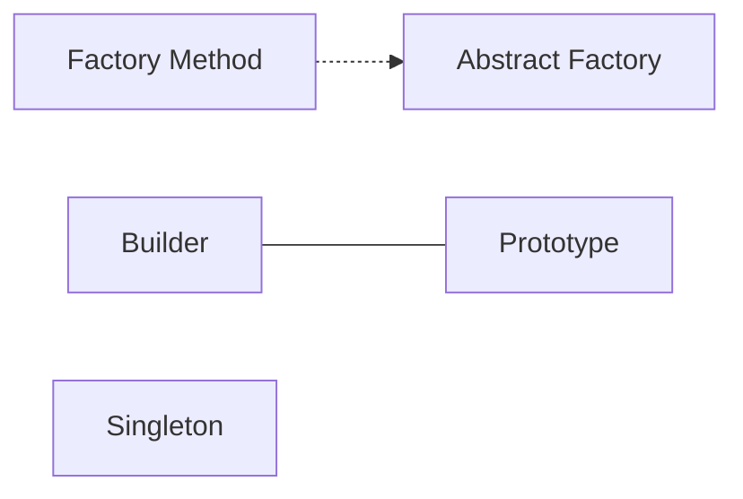

+++
title = "Creational Patterns"
book_title = "创建型模式"
weight = 4
+++

创建型模式提供更灵活的对象创建机制，降低对具体类的依赖，提高复用。

```mermaid
flowchart LR
  FM[Factory Method]
  AF[Abstract Factory]
  BD[Builder]
  PT[Prototype]
  SG[Singleton]
  FM -.-> AF
  BD --- PT
```
