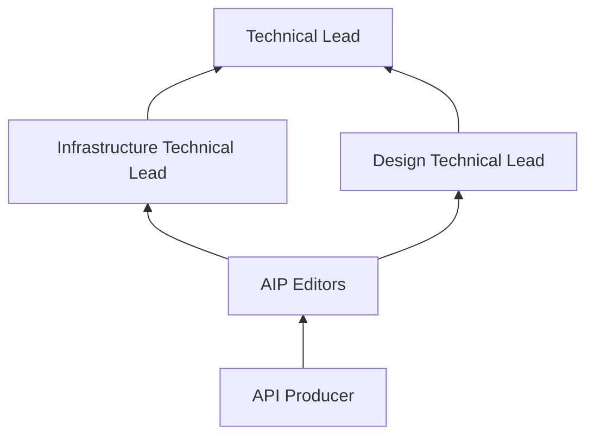
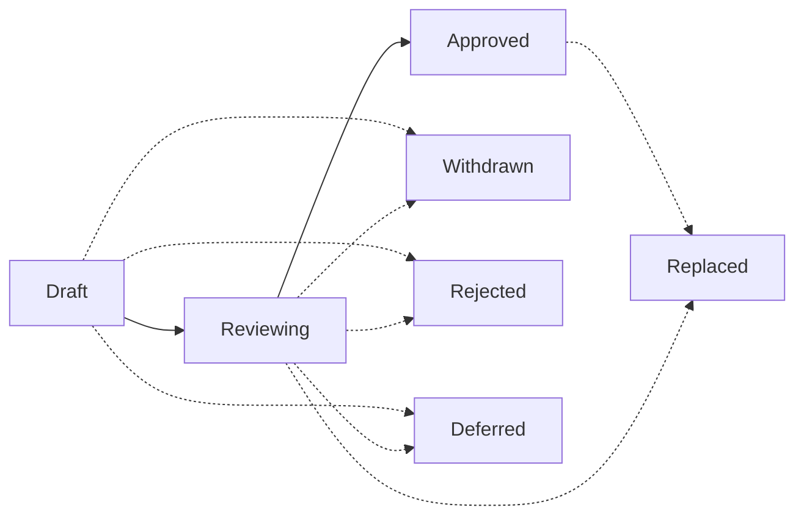

+++
title = "AIP-1: AIP 目的与指南"
weight = 10
+++

**英文标题**：AIP Purpose and Guidelines  
**原文**：[AIP-1](https://google.aip.dev/1) · approved · 创建 2018-08-20  
**许可**：原文 © Google，[CC BY 4.0](https://creativecommons.org/licenses/by/4.0/)

随着 Google APIs 规模增长，API Governance 团队也在扩大以支撑它们，越来越需要一套可供 API producer、reviewer 及其他相关方查阅的文档。API style guide 与入门的 One Platform 文档有意写得简短、偏高层。AIP 集合提供一种方法，为 API 设计指导提供一致的文档。

## 什么是 AIP？

AIP 是 **API Improvement Proposal**，一份为 API 开发提供高层、简明文档的设计文档。它们应作为 Google 内部 API 相关文档的事实来源，以及 API 团队讨论并就 API 指导达成共识的途径。AIP 以 Markdown 文件维护于 [AIP GitHub repository](https://github.com/googleapis/aip)。

## AIP 的类型

AIP 有若干类型，如下所述。类型列表可随需要演进。

### Guidance

这类 AIP 描述 API 设计指导。作为给 API producer 的说明，帮助写出简单、直观、一致的 API，并作为 API reviewer 写评审意见的依据。

### Process

这类 AIP 描述围绕 API 设计的过程。它们常常影响 AIP 过程本身，用来改进 AIP 的处理方式。

## Stakeholders

任何过程都有多方利益相关者参与 AIP 的评审与协作。以下是从 API producer 开始的升级路径摘要。

如上图所示，Technical Lead 是 AIP 过程的最终决策者，也是必要时的最终升级点。

### Editors

editors 是对 AIP 做决定的人。总体目标是 AIP 过程保持协作，并主要基于共识推进。但仍需要有限数量的指定 approver；这些 Googlers 将作为 general scope 下每篇 AIP 的 approver。

当前 AIP editors 名单：

- Angie Lin ([@alin04](https://github.com/alin04))
- Jon Skeet ([@jskeet](https://github.com/jskeet))
- Jose Juan Zavala Iglesias ([@itsStrobe](https://github.com/itsStrobe))
- Louis Dejardin ([@loudej](https://github.com/loudej))
- Noah Dietz ([@noahdietz](https://github.com/noahdietz))
- Sam Levenick ([@slevenick](https://github.com/slevenick))
- Sam Woodard ([@shwoodard](https://github.com/shwoodard))

editors 还负责引导 AIP、管理 AIP 管道与工作流的行政与编辑事务。他们批准指向 AIP 的 Pull Request、分配提案编号、管理议程、设置 AIP 状态，等等。他们也确保 AIP 可读（正确的拼写、语法、句子结构、标记等）。

AIP 编辑资格由现任 editors 邀请。

## Domain-specific AIPs

有些 AIP 可能只适用于特定域（例如仅某 Product Area 内的 API，甚至某团队）。此时该组会按 [AIP-2]() 获得一块 AIP 编号，且适用的 AIP 会清楚标明其 scope。

## States

AIP 在走完过程的不同时刻会处于不同状态。以下是各状态摘要。

### Draft

AIP 的初始状态是 "Draft"。表示该 AIP 正在讨论与迭代，主要由原作者进行。editors **可以** 在此阶段介入，但并非必须。

**Note:** 若需要大量高层迭代，建议先在 Google doc 中起草 AIP，而不是直接开 Pull Request。从 Google Docs 迁入 AIP 系统的 AIP，在有足够批准的前提下，**可以** 跳过 draft 状态，直接进入 reviewing。

### Reviewing

当对一篇 AIP 的讨论大体结束后、正式接受之前，它进入 "Reviewing" 状态。表示作者已对提案大致达成共识，editors 开始介入。此阶段 editors 可以在继续推进前要求修改或提出替代方案。

**Note:** 作为正式要求，除作者外，一名 AIP approver **must** 提供正式签字，才能把 AIP 推进到 reviewing 状态。此外，**must not** 存在来自其他 approver 的正式反对（GitHub Pull Request 上的 "changes requested"）。

### Approved

当一篇获批的 AIP 已达成一致，它进入 "approved" 状态，并被视为 "best current practice"。

**Note:** 作为正式要求，除作者外，两名 AIP approver **must** 提供正式签字，才能把 AIP 推进到 approved 状态。此外，**must not** 存在来自其他 approver 的正式反对（GitHub Pull Request 上的 "changes requested"）。

### Withdrawn

若 AIP 被作者或 champion 撤回，则进入 "withdrawn" 状态。已撤回的 AIP 可由另一 champion 接手。

### Rejected

若 AIP 被 AIP editors 拒绝，则进入 "rejected" 状态。被拒绝的 AIP 仍会保留，作为文档与参考，供日后讨论使用。

### Deferred

若一篇 AIP 在相当长时间内没有动作，editors 可将其标为 "deferred"。

### Replaced

若一篇 AIP 被另一篇 AIP 取代，则进入 "replaced" 状态。AIP editors 负责提供说明，解释取代与理由（取代它的 AIP 也应清楚解释理由）。

一般而言，API producer 应主要依赖处于 "approved" 状态的 AIP。

## Workflow

以下工作流描述如何提出一篇 AIP，以及如何把 AIP 从提案推进到实施再到最终接受。

### Overview

### 提出一篇 AIP

要提出一篇 AIP，先 [open an issue](https://github.com/googleapis/aip/issues) 以流传核心想法并收集初步反馈。一般应能用大约两页说清这个想法。

提出新 AIP 或修改既有 AIP 时，最好引用 prior art 和/或该提案会影响的示例用例，以确保提案落在真实问题空间里。因此，提案 **should** 提供具体引用和/或定义清楚的例子。合适材料包括但不限于：

- 既有的外部 RFC 或标准
- 已对齐到相似模式的一批 API，例如 `Search` methods
- 一个或多个 API 中尚未解决、已经存在或可能存在的具体用例，例如为 [AIP-143]() Unicode CLDR region codes 增加一个 [AIP-202]() Format

准备好后，在 AIP 目录新建文件 `aip/new.md` 并创建 Pull Request。确保该 Pull Request 可由 maintainers 编辑。

多数情况下，editors 会给提案分配 AIP 编号，并以 "Reviewing" 状态提交该 Pull Request。若有明显理由（例如该提案已在另一篇 AIP 中讨论并被拒绝，或根本上不成立），editors 可以当场拒绝一篇 AIP，此时 Pull Request 不会被合并。

### 讨论一篇 AIP

Pull Request 合并后，AIP 作者负责在后续的 approval pull request 上 champion 该 AIP。这意味着作者有责任推动围绕提案的共识。这可能包括在 API Governance 团队定期会议上讨论。

在讨论过程中，AIP 作者可以通过向 Pull Request 提交后续 commit 来修改 AIP。

### 接受一篇 AIP

editors 会共同确保合格提案不会在评审中滞留。

要获得最终批准，一篇 AIP **must** 至少得到对该 AIP 所覆盖域（design 或 infrastructure）负有责任的 Technical Lead 以及至少另一名 editor 的批准，且没有 editor 在主动请求修改。

**Note:** 若某 AIP editor 是该 AIP 的主要作者，则至少还需要两名**其他** editors 批准。

AIP 获批后，editors 会更新其状态以反映这一点，并提交 Pull Request。

### 撤回或拒绝一篇 AIP

AIP 作者在进一步考虑后，可以决定某篇 AIP 不应继续推进。若如此，作者可通过更新 Pull Request、加入撤回声明并解释理由来撤回该 AIP。此外，作者可能无法在群体中达成共识，AIP editors 也可以选择拒绝该 AIP。此时 AIP editors 应修改 Pull Request，加入拒绝声明并解释理由。两种情况下，AIP editors 都会相应更新状态并提交 Pull Request。

### 取代一篇 AIP

在少见情况下，可能需要用另一篇 AIP 取代现有 AIP。这不是常规做法：对已批准 AIP 做小幅编辑是可以的，也是微调指导的常见方式。然而，若新指导在某种程度上从根本上改变了旧指导，则 AIP editors 应创建一篇新 AIP；一旦获批，它将取代旧篇。旧篇随后进入 "Replaced" 状态，并链接到新的、当前的 AIP。

## Changelog

- **2025-01-09**：增加提案中须包含引用/示例的要求。
- **2024-09-04**：更新现任 editors 名单，并移除 Technical Leads。
- **2023-05-10**：更新现任 editors 与 Technical Leads 名单。
- **2019-07-30**：进一步澄清 AIP 法定人数要求。
- **2019-05-12**：将 AIP approvers 与 editors 合并为同一职位，把批准规则从全体法定人数放宽。
- **2019-05-04**：改为描述 GitHub 流程，而不再是内部流程。
