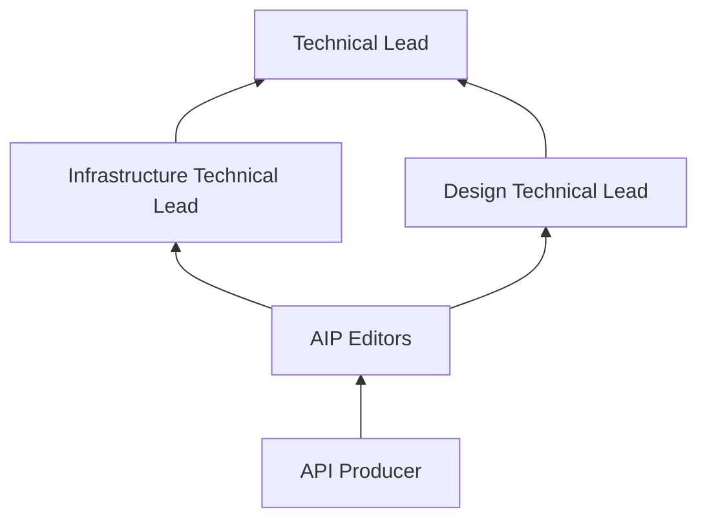
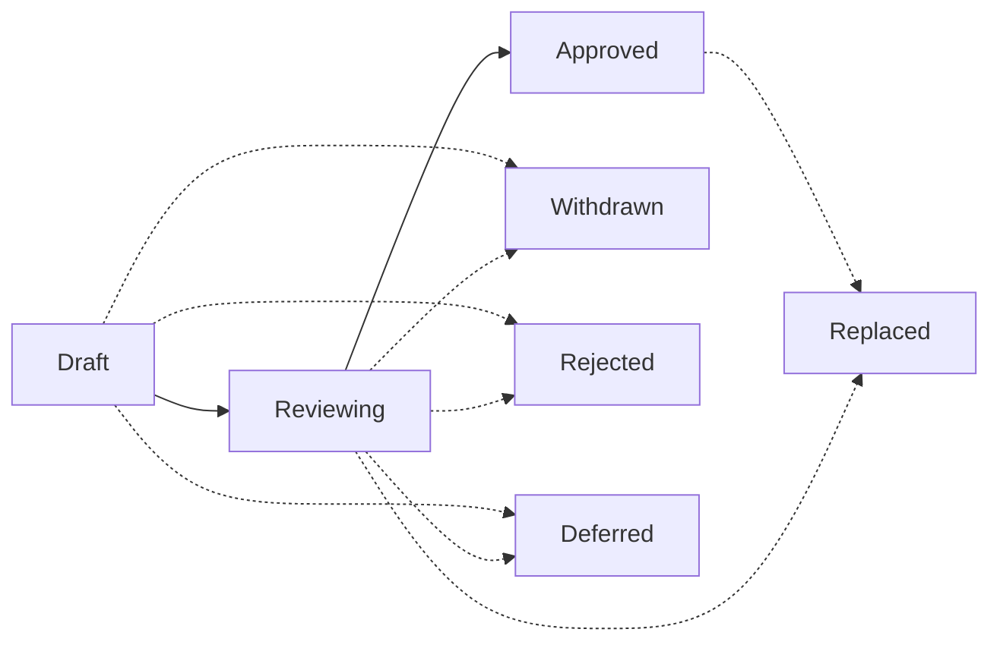

+++
title = "AIP-1: AIP 目的与指南"
weight = 10
+++

**英文标题**：AIP Purpose and Guidelines  
**原文**：[AIP-1](https://google.aip.dev/1) · approved · 创建 2018-08-20  
**许可**：原文 © Google，[CC BY 4.0](https://creativecommons.org/licenses/by/4.0/)

Google APIs 越来越大，Governance 也跟着扩。短短的 style guide 和 One Platform 入门撑不住日常查阅：producer、reviewer 都需要同一套、写得够细的设计文档。AIP 就是这套文档。写法统一，状态清楚，方便讨论和拍板。

## 什么是 AIP？

AIP 是 API Improvement Proposal。给 API 开发用的高层、短文档。在 Google 内部，它应当是 API 相关文档的事实来源；团队也靠它讨论、达成 API 指导。文件用 Markdown，放在 [AIP GitHub repository](https://github.com/googleapis/aip)。

## 两类 AIP

类型可以以后再加。眼下就两类。

### Guidance

设计指导。给 API producer 写简单、直观、一致的 API；reviewer 写意见时也拿它当依据。

### Process

围绕 API 设计的过程。常常会改到 AIP 流程本身，用来把提案怎么走、谁拍板说清楚。

## 谁拍板

从 API producer 往上，升级路径如下。

Technical Lead 是最终决策者，也是最后的升级点。

### Editors

日常决定由 editors 做。过程尽量靠协作和共识。但 general scope 下每篇 AIP 仍要有指定的 approver，这批人就是 editors。

当前 AIP editors：

- Angie Lin ([@alin04](https://github.com/alin04))
- Jon Skeet ([@jskeet](https://github.com/jskeet))
- Jose Juan Zavala Iglesias ([@itsStrobe](https://github.com/itsStrobe))
- Louis Dejardin ([@loudej](https://github.com/loudej))
- Noah Dietz ([@noahdietz](https://github.com/noahdietz))
- Sam Levenick ([@slevenick](https://github.com/slevenick))
- Sam Woodard ([@shwoodard](https://github.com/shwoodard))

editors 还管行政和编辑：引导提案、跑管道、批指向 AIP 的 Pull Request、分配编号、管议程、改状态。也要保证可读：拼写、语法、句子、标记。

谁能当 editor：现任 editors 邀请。

## 只适用于某个域的 AIP

有的 AIP 只管一块（某个 Product Area，甚至某个团队）。这种组按 [AIP-2]() 拿一段编号，文里会写清 scope。

## 状态

一篇 AIP 走过程时会换状态。

### Draft

起步状态。还在讨论、还在改，主要是原作者在做。editors 可以介入，但不是必须。

需要大量高层来回时，建议先写 Google doc，不要一上来就开 Pull Request。从 Google Docs 迁进来的稿，只要批准够了，可以跳过 draft，直接进 reviewing。

### Reviewing

讨论大体完了，还没正式收下。作者这边共识已经差不多，editors 开始上手。推进之前，editors 可以要求改，也可以提替代方案。

正式要求：除作者外，必须另有一名 AIP approver 正式签字，才能进 reviewing。另外，不得存在其他 approver 的正式反对（GitHub Pull Request 上的 "changes requested"）。

### Approved

达成一致，视为当前最佳实践。

正式要求：除作者外，必须有两名 AIP approver 正式签字。同样，不得存在其他 approver 的正式反对。

### Withdrawn

作者或 champion 撤回。别人可以接手再推。

### Rejected

editors 拒绝。稿子留着当文档和参考，以后讨论还能翻。

### Deferred

长时间没动静，editors 可以标成 deferred。

### Replaced

被另一篇 AIP 取代。editors 负责说明取代了什么、为什么；新篇也应当把理由写清楚。

API producer 应当主要依赖 approved 状态的 AIP。

## 工作流

从提出到接受，大致这样走。

### 总览

### 提出一篇 AIP

先 [open an issue](https://github.com/googleapis/aip/issues)，把核心想法传开，收第一轮反馈。一般两页左右能说清。

提新 AIP 或改旧 AIP，最好带 prior art，或带会被这篇影响到的真实用例，保证落在真问题上。因此提案应当给出具体引用，或定义清楚的例子。合适材料包括但不限于：

- 既有的外部 RFC 或标准
- 已经对齐到相似模式的一批 API，例如 `Search` methods
- 一个或多个 API 里尚未解决、已经存在或可能存在的具体用例。例如给 Unicode CLDR region codes 加一个 Format，见 [AIP-143]()、[AIP-202]()

准备好后，在 AIP 目录新建 `aip/new.md`，开 Pull Request。确保 maintainers 能改这个 PR。

多数情况下，editors 会给编号，并以 Reviewing 状态合入。理由很明显时（例如另一篇已经讨论过并拒绝了，或根本上不成立），editors 可以当场拒绝，PR 不会合。

### 讨论一篇 AIP

PR 合入后，作者要在后续的 approval pull request 上 champion 这篇。推动共识是作者的责任。可能要拿到 API Governance 例会上谈。

讨论中，作者可以继续往 PR 提交 commit 来改稿。

### 接受一篇 AIP

editors 一起盯着，合格提案不要卡在评审里。

最终批准：必须至少得到对该 AIP 所覆盖域（design 或 infrastructure）负责的 Technical Lead，以及至少另一名 editor 的批准，并且没有 editor 在主动要求修改。

若某 AIP editor 是主要作者，则必须再有至少两名其他 editors 批准。

获批后，editors 更新状态并提交 Pull Request。

### 撤回或拒绝

作者后来觉得不该继续，可以撤回：改 PR，加上撤回声明和理由。达不成共识时，editors 也可以拒绝：改 PR，加上拒绝声明和理由。两种情况，editors 都会改状态并提交 PR。

### 取代一篇 AIP

少见。小改已批准 AIP 是可以的，也是微调指导的常见做法。但新指导如果从根本上改了旧指导，editors 应当另写一篇；新篇获批后取代旧篇。旧篇进入 Replaced，并链到当前 AIP。

## Changelog

- **2025-01-09**：增加提案中须包含引用/示例的要求。
- **2024-09-04**：更新现任 editors 名单，并移除 Technical Leads。
- **2023-05-10**：更新现任 editors 与 Technical Leads 名单。
- **2019-07-30**：进一步澄清 AIP 法定人数要求。
- **2019-05-12**：将 AIP approvers 与 editors 合并为同一职位，把批准规则从全体法定人数放宽。
- **2019-05-04**：改为描述 GitHub 流程，而不再是内部流程。
