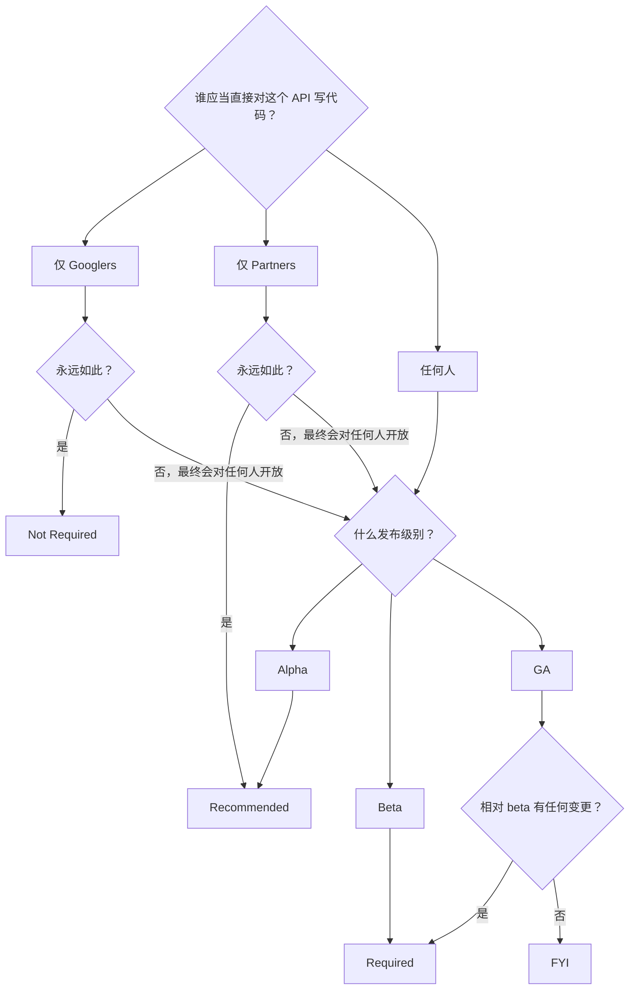

+++
title = "AIP-100: API 设计评审常见问题"
weight = 10
+++

**英文标题**：API Design Review FAQ  
**原文**：[AIP-100](https://google.aip.dev/100) · approved · 创建 2018-08-27  
**许可**：原文 © Google，[CC BY 4.0](https://creativecommons.org/licenses/by/4.0/)

API design review 的存在，是为了在整个 API 语料中保证简单、直观、一致的 API 体验。

## 我需要 API 设计批准吗？

**TL;DR：** 若你要发布的 API 是用户可以对其写代码的（现在或将来），且质量级别为 beta 或 GA，则通常需要 API 设计批准。

API design review 根本上是为了确保我们为用户提供简单、一致的体验，因此只期望用于用户会直接对其写代码的 API。

下面的流程图说明你的 API 是否需要走设计评审过程：

### 谁应当直接对其写代码？

较复杂的问题之一是：「谁应当直接对这个 API 写代码？」API design review 主要关心 API 的受众。也就是说，我们关心谁被允许对服务自行发出 HTTP/gRPC 调用，以及谁能看到文档。（我们**不**关心服务是否暴露在公网上之类的问题。）

若打算让一般公众阅读文档并编写与该服务交互的代码，则期望做设计评审。

下列情形 **do not** 要求设计评审：

- 将永远只被 Googlers 或内部工具（例如 Pantheon）使用的 API。
- 将永远只被 Google 发布的可执行程序调用的 API（即使该 API 可能从可执行文件中被逆向出来）。
- 将永远只被合同约束下的单个客户或一小群客户调用、且**永远不会**更广泛提供的 API。（此情形仍建议设计评审，但非必须。）

### Alpha

对 alpha，API design review 可选但建议做。常常有理由尽快从客户那里拿到初步反馈；发布 alpha 可以是获取数据、从而决定某些可用性问题上最佳答案的一种方式；因此跳过评审可能更省事。另一方面，发布 alpha 需要先做出实现，若 beta 阶段的 API design review 提出关切，再改实现就要花工程力气。因为 API design review 可以先于实现工作，我们建议为 alpha 做设计评审。

## 为什么设计评审重要？

**TL;DR：** 产品卓越。

我们的设计评审过程存在，是为了确保呈现给客户的 API **简单**、**直观**、**一致**。你的 reviewer 会以天真用户的立场看待你的 API，思考它提供的资源与动作，并尽量让表面既易用又可扩展。

你的 design reviewer 不仅在评估你的 API，也在检查它是否与 Google 既有 API 语料一致。许多客户会使用多个 API，因此我们的约定与命名选择必须符合客户预期。

## 我可以期待什么？

### 评审过程要多久？

reviewers 会努力跟上分配给他们的评审并频繁给反馈，以免造成不必要的延迟，但通常最好尽早开始评审过程，以防有延误。

设计评审过程随底层 API 表面的规模与复杂度而变：

- 对既有 API 的增量变更一般要几天。
- 小型 API 通常大约一周。
- 带有大表面的全新 API 往往不少于一周。表面特别大时（例如 Cloud AutoML），评审可能要一个月或更久才能走完设计评审。

### reviewers 如何看待我的 API？

API reviewers 寻求以用户同样的方式看待你的 API：主要聚焦 API 表面及其面向用户的文档。在理想世界里，你的 API reviewer 会提出用户会问的那类设计问题（并推动 API 一开始就少引出这类问题）。

### 什么是 precedent？

一般而言，我们希望 Google APIs 尽可能一致。客户学会第一个 Google API 之后，学第二个（然后第三个，以此类推）应当更容易，因为我们在一致地使用相同模式。

我们所说的 **precedent**，是指先前 API 已经做出的决定，在相似情形下一般应对较新的 API 有约束力。最常见的例子是命名：我们有一份 [standard fields](https://cloud.google.com/apis/design/standard_fields) 清单，规定如何使用 `name`、`create_time` 等常用术语，并规定我们总是给同一概念附上**同一个**名字。

precedent 也适用于**模式**。所有 API 都应以同样方式实现分页。长时运行操作、导入与导出等亦然。一旦某模式已确立，我们就寻求在凡适用之处以同样方式实现它。

## 我该做什么？

### ……若我的发布截止日期很紧？

你能做的最好的事，是尽早进入设计评审。另外，让你的 reviewers 知道时间表，好让他们知情，并努力为你提供尽可能好的服务。我们**希望**你在可能的情况下赶上截止日期。

对时间敏感的 *alpha* 发布，API **may** 在未获得设计评审批准的情况下发布。此类发布 **must** 限于已知的一组用户。此时 reviewers 会提供备注，供 API 团队在后续阶段考虑。

**Warning:** 带着未完成的设计评审以 alpha 发布 API，**does not** 把该 API 的那些决定固化。升到 beta 仍需要设计评审；若有问题，API reviewers 会挡住你的 beta 发布。

alpha 之后的发布阶段，API design review 是强制的，因为它会影响全局用户体验。你团队的不一致影响的不只是你的团队。

有时必须在产品卓越与工程力气或截止日期之间做困难选择。这些是困难的业务决定，我们理解它们有时是必要的；然而，若选择绕过设计评审或无视 reviewers 的反馈，必须由 director 或 VP 明确选择把这些其它关切置于产品卓越之上。

### ……怎样让我的评审更快？

几点提示：

- 尽早开始 API 评审，并频繁跟进。
- 事先运行 [API linter](https://github.com/googleapis/api-linter)。（若你在任何地方禁用了 linter，解释原因。reviewers 常常发现 linter 被禁用，正是因为它做了该做的事。）
- 确保每条 message、RPC 和字段都有**有用的**注释。注释应为合格的美式英语，并说出有意义的内容。
- 若你的 API reviewer 请你解释某事，把解释加在 **proto 注释里**，而不是代码评审对话里。这常常能为你省掉一轮往返。

### ……若我的某位 API reviewer 没有响应？

在 Chat 上联系该 reviewer。若不行，联系另一位 reviewer，由其协调。若仍不行，按 [AIP-1]() 升级。

### ……若我有设计问题？

首先查阅 [API style guide](https://cloud.google.com/apis/design/)、[AIP index](https://google.aip.dev/)，以及 Google 内其它公开 API。其它公开 API 特别有价值；常见情况是已有人遇到过与你的问题相关的情形。

### ……若我有那里没覆盖的问题？

把问题发到 api-design@google.com。

当你就与 API 设计相关的具体问题寻求指导，并清楚说明用例且提供例子时，这通常最有效。

**Note:** 该列表的成员几乎全是志愿者，他们大部分时间在做别的事。我们会尽量及时回复，但请对我们有耐心。

### ……若一个问题很复杂，并在 Change List 里拖着？

在可行时，代码评审界面是解决问题的最佳方式；但有时问题足够复杂，在代码评审工具里谈清楚并不现实。此时联系你的 reviewers，约一次会议。一般而言，多数问题可以在 30 分钟内讨论完。

发生这种情况时，确保有人把讨论内容记在 Change List 里，以便保留历史。

### ……若我的 API 需要违反一条标准？

清楚记录（在 proto 的内部注释中）你正在违反一条 API 设计指南以及这样做的理由。该注释 **must** 以 `aip.dev/not-precedent` 为前缀。

一般而言，你违反设计指南的理由 **should** 符合 [AIP-200]() 所列举的原因之一。若不符合，与你的 API reviewer 一起确定正确做法。

### ……若 reviewer 又提起一个先前已了结的问题？

若你的 reviewer 与 API 先前阶段的不同，这可能会发生。一般而言，最好的做法就是引用当初决定该问题的代码评审。reviewers 希望避免给你造成反复，因此通常会尊重先前评审。这通常足以迅速了结该问题。

偶尔，reviewer 可能认为先前 reviewer 犯了重大错误，且纠正它很重要。此时你与你的 reviewer 应一起确定最佳行动方案。

### ……若团队与 reviewers 强烈不同意？

按 [AIP-1]() 升级。

## 我的 Product Area 或团队有特别指南吗？

Cloud Product Area 有额外指南，以确保 Cloud 范围内进一步统一，且 Cloud APIs 有自己的 reviewer 池。其它团队可以采用类似（但不一定相同）的规则与系统。产出多个 API 的某些团队（例如 machine learning）也可能有适用于那一组 API 的指南。

在所有情形下，我们努力把这些指南做成 AIP；较高的 AIP 编号留给特定 Product Area 与团队使用（见 [AIP-2]()），这些 AIP 列在 [AIP index](https://google.aip.dev/) 中。
