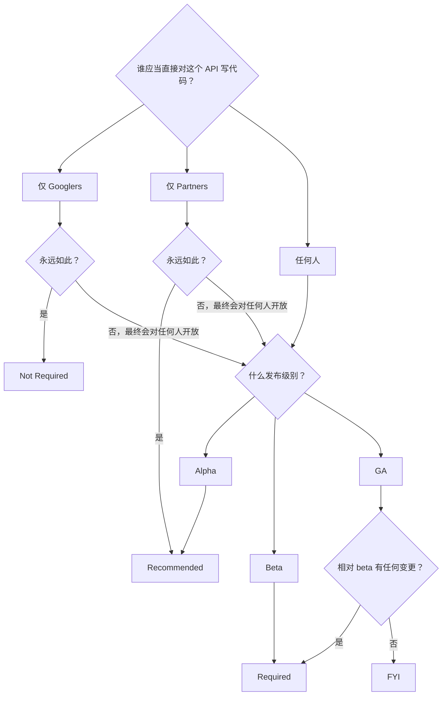

+++
title = "AIP-100: API 设计评审常见问题"
weight = 10
+++

**英文标题**：API Design Review FAQ  
**原文**：[AIP-100](https://google.aip.dev/100) · approved · 创建 2018-08-27  
**许可**：原文 © Google，[CC BY 4.0](https://creativecommons.org/licenses/by/4.0/)

API design review 要解决的是：整个 API 语料里，用户碰到的体验是否简单、直观、一致。下面按评审时最常问的问题来讲：要不要评、评什么、卡住了怎么办。

## 我需要 API 设计批准吗？

若你要发布的 API 是用户可以对其写代码的（现在或将来），且质量级别是 beta 或 GA，通常需要 API 设计批准。

评审关心的是用户会直接对其写代码的 API。只给内部工具用、永远不对外的，不在这个范围内。

要不要走设计评审，可以按这张图看：

### 谁应当直接对其写代码？

这句问的是受众。谁被允许对服务自行发 HTTP/gRPC 调用，谁能看到文档。不关心服务是否挂在公网上。

若打算让一般公众读文档、写跟该服务交互的代码，就期望做设计评审。

下列情形不要求设计评审：

- 将永远只被 Googlers 或内部工具（例如 Pantheon）使用的 API。
- 将永远只被 Google 发布的可执行程序调用的 API（即使 API 可能从可执行文件里被逆向出来）。
- 将永远只被合同约束下的单个客户或一小群客户调用、且永远不会更广泛提供的 API。此情形仍建议评审，但不是必须。

### Alpha

对 alpha，设计评审可选，但建议做。常常有理由尽快从客户那里拿初步反馈；发 alpha 可以是收集数据、好决定某些可用性问题上最佳答案的办法，所以跳过评审可能更省事。另一方面，发 alpha 得先做出实现；若 beta 评审提出关切，再改实现就要花工程力气。设计评审可以先于实现，所以建议 alpha 也评。

## 为什么设计评审重要？

为了产品卓越。

过程存在，是为了确保交给客户的 API 简单、直观、一致。reviewer 会站在天真用户那边看：资源是什么、动作是什么，表面既要好用，也要能往后扩。

reviewer 不只评你这一篇，也在看它跟 Google 既有 API 语料是否一致。许多客户会用多个 API，约定和命名必须符合他们已经形成的预期。

## 我可以期待什么？

### 评审要多久？

reviewers 会尽量跟上分配给他们的评审，频繁给反馈，少造成不必要的延迟。但仍应当尽早开始，以防卡住。

耗时跟表面规模、复杂度有关：

- 既有 API 的增量变更：一般几天。
- 小型 API：大约一周。
- 带大表面的全新 API：往往不少于一周。特别大时（例如 Cloud AutoML），可能要一个月或更久。

### reviewers 怎么看我的 API？

他们尽量用用户的方式看：主要盯 API 表面和面向用户的文档。理想情况下，会问出用户会问的那类设计问题，并推动 API 一开始就少引出这类问题。

### 什么是 precedent？

我们希望 Google APIs 尽量一致。客户学会第一个之后，学第二个、第三个应当更容易：同一套模式反复出现。

precedent 指先前 API 已经做出的决定，在相似情形下一般应对较新的 API 有约束力。最常见的是命名：有一份 [standard fields](https://cloud.google.com/apis/design/standard_fields) 清单，规定 `name`、`create_time` 等常用术语怎么用，同一概念永远同一个名字。

precedent 也管模式。分页应当各 API 同一套。长时运行操作、导入、导出也一样。模式一旦立住，凡适用之处就按同一方式实现。

## 我该做什么？

### 截止日期很紧？

最好的办法是尽早进评审。另外告诉 reviewers 时间表，让他们知情，并尽量配合。我们希望你在可能的情况下赶上截止日期。

对时间敏感的 alpha 发布，API 可以在未获设计评审批准的情况下发布。此类发布必须限于已知的一组用户。reviewers 会给备注，供后续阶段考虑。

带着未完成的设计评审以 alpha 发布，不会把那些决定固化。升到 beta 仍要评审；有问题，reviewers 会挡住 beta。

alpha 之后的发布阶段，设计评审是强制的：它影响全局用户体验。你团队的不一致，影响的不只是你的团队。

有时必须在产品卓越和工程力气、截止日期之间做困难选择。这些是困难的业务决定，有时确实必要。但若选择绕过评审或无视 reviewers 的反馈，必须由 director 或 VP 明确选择：把这些关切放在产品卓越之上。

### 怎样让评审更快？

- 尽早开始，频繁跟进。
- 事先跑 [API linter](https://github.com/googleapis/api-linter)。若在任何地方禁用了 linter，解释原因。reviewers 常常发现：禁用，正是因为它做了该做的事。
- 确保每条 message、RPC、字段都有有用的注释。注释应当是合格的美式英语，并说出有意义的内容。
- reviewer 请你解释某事时，把解释写进 proto 注释，不要只写在代码评审对话里。常常能少一轮往返。

### 某位 reviewer 没有响应？

在 Chat 上联系该 reviewer。不行就找另一位，由其协调。还不行，按 [AIP-1]() 升级。

### 我有设计问题？

先查 [API style guide](https://cloud.google.com/apis/design/)、[AIP index](https://google.aip.dev/)，以及 Google 内其它公开 API。其它公开 API 特别有价值：常见情况是已有人碰到过跟你相关的情形。

### 那里没覆盖？

把问题发到 api-design@google.com。

就具体设计问题寻求指导，并清楚说明用例、提供例子时，通常最有效。

这个列表的成员几乎全是志愿者，他们大部分时间在做别的事。会尽量及时回复，但请耐心。

### 问题很复杂，在 Change List 里拖着？

可行时，代码评审界面是解决问题的最佳方式。有时问题足够复杂，在工具里谈清楚并不现实。这时联系 reviewers，约一次会议。多数问题可以在 30 分钟内谈完。

发生这种情况时，确保有人把讨论记在 Change List 里，历史才留得住。

### API 需要违反一条标准？

在 proto 的内部注释里清楚记录：你正在违反一条 API 设计指南，以及为什么。该注释必须以 `aip.dev/not-precedent` 为前缀。

违反的理由应当符合 [AIP-200]() 所列举的原因之一。不符合，就跟 API reviewer 一起确定正确做法。

### reviewer 又提起一个先前已了结的问题？

若这位 reviewer 跟先前阶段的不是同一人，这可能会发生。最好的做法就是引用当初决定该问题的代码评审。reviewers 希望避免反复，通常会尊重先前评审。这通常足以迅速了结。

偶尔，reviewer 可能认为先前那位犯了重大错误，且纠正很重要。这时你和 reviewer 应一起确定下一步。

### 团队与 reviewers 强烈不同意？

按 [AIP-1]() 升级。

## 我的 Product Area 或团队有特别指南吗？

Cloud Product Area 有额外指南，好在 Cloud 范围内进一步统一，且 Cloud APIs 有自己的 reviewer 池。其它团队可以采用类似（不一定相同）的规则与系统。产出多个 API 的某些团队（例如 machine learning）也可能有适用于那一组的指南。

我们努力把这些指南做成 AIP。较高的 AIP 编号留给特定 Product Area 与团队（见 [AIP-2]()），列在 [AIP index](https://google.aip.dev/) 中。
