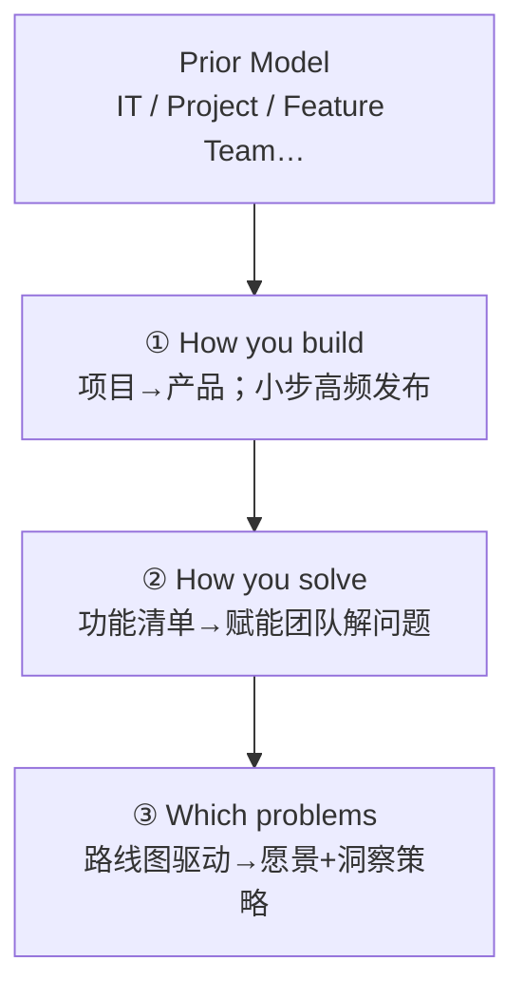

+++
title = "简介"
book_title = "产品运作模型 (Product Operating Model)"
glossary = ["product-operating-model"]
+++

基于 Marty Cagan 等《Transformed: Moving to the Product Operating Model》的学习笔记（接近摘记粒度）。专名以 **英文** 为准，旁注中文。

一句话：**Product Operating Model** 不是某一套流程，而是强产品公司共同相信的一组第一性原理——持续做出「客户爱用、且对公司可行」的技术驱动方案，并把技术投入的回报做到最大。

与站内 **Scrum** 笔记：仪式≠转型；没有每两周（更好是更频）可靠发布，挂多少 Agile 招牌都不算真敏捷。
