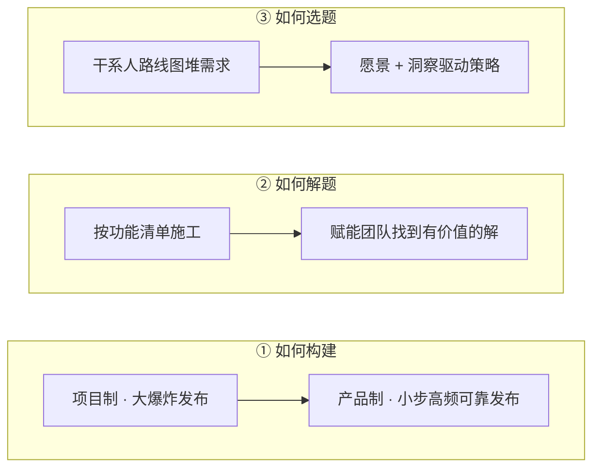

+++
title = "简介"
book_title = "产品运作模型 (Product Operating Model)"
glossary = ["product-operating-model"]
+++

基于 Marty Cagan 等《Transformed》的学习笔记（接近摘记）。专名以 **英文** 为准，旁注中文；悬停看气泡。

### 这本书在说什么

**Product Operating Model**（产品运作模型）不是某一套流程，而是强产品公司怎么运作的一组原则：

> 持续做出「客户爱用、且对公司可行」的技术驱动方案，并把技术投入的回报做到最大。

转型前的旧方式合称 **Prior Model**（常见形态：IT 接单、项目制、功能团队等）。

### 转型看三维，不是换仪式

换站会、迭代、教练 ≠ 转型完成。书用下面三维定义「真的换了没有」——每行是同一维的 **旧 → 新**：

三维要一起动。只改一维（比如只上 Agile 仪式、发布仍是季度大爆炸）通常不够。

对照站内 **Scrum** 笔记：至少每两周能可靠发布一次（能更频繁更好）；做不到这一点，挂多少 Agile 招牌都不算真敏捷。
