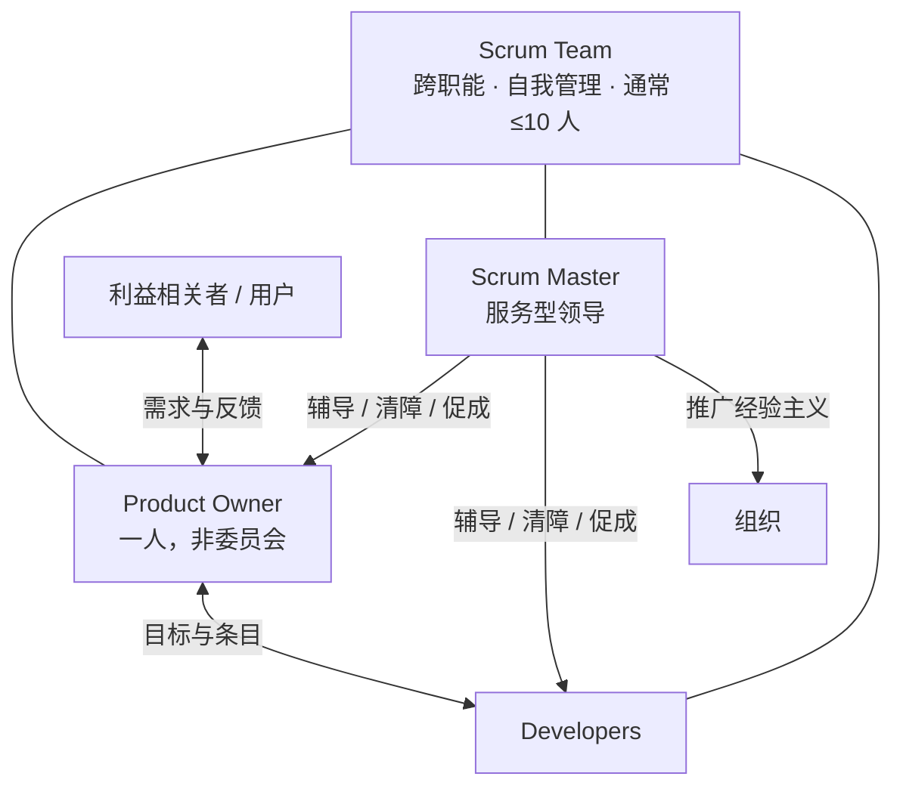

+++
title = "角色与问责"
weight = 1
+++

Scrum 只有三种问责，没有项目经理等额外角色。一次只服务一个 **Product Goal**。

## 角色速查

| 角色 | 核心问责 | 典型产出 |
|------|----------|----------|
| **Product Owner** | 最大化产品价值；管好 Product Backlog | Product Goal、有序 Backlog、优先级决策 |
| **Developers** | 每个 Sprint 做出可用 Increment | Sprint Backlog、符合 DoD 的 Increment |
| **Scrum Master** | 建立 Scrum；提升团队有效性 | 辅导、清障、保证事件有效发生 |

## 协作关系

## 边界（易混点）

- **PO**：最终对 Backlog 内容与排序负责；可委托干活，不可委托问责。
- **Developers**：自己决定「怎么做」；每日按 Sprint Goal 调整计划。
- **SM**：不替团队做决策；保证事件发生且有产出，移除障碍。
