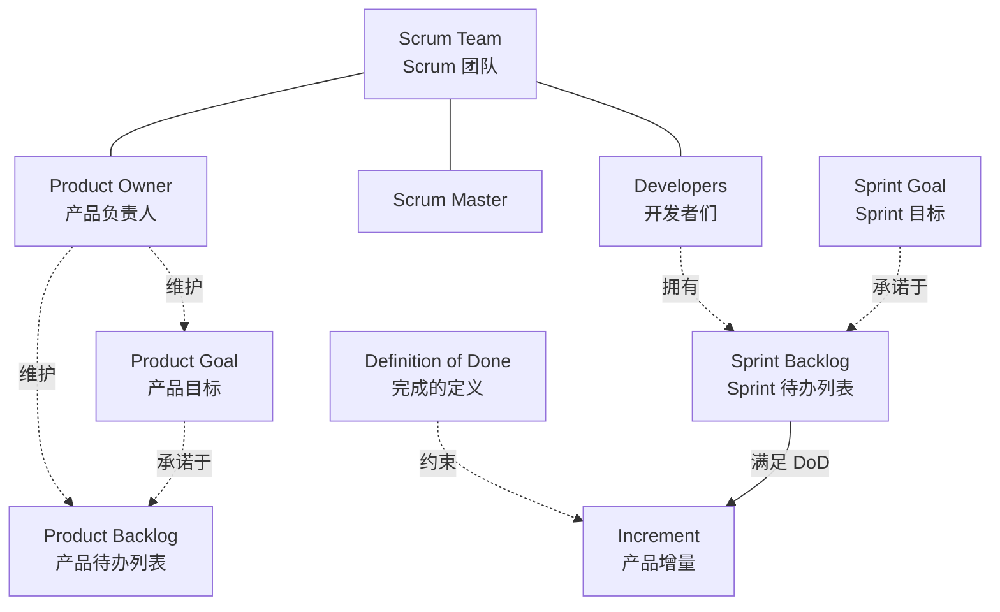

+++
title = "名词介绍"
weight = 1
+++

流程图节点统一用 **英文专名**（旁注常用中文）。正文里的专名或中文别名可悬停看气泡，点「显示更多」跳到本页对应词条。

## 框架与节奏

### Scrum

用固定节奏交付可用增量的轻量框架。

### Sprint

- **中文**：冲刺  
- 固定时长（≤1 个月）的工作容器；上一个结束，下一个立刻开始。

### Scrum Team

- **中文**：Scrum 团队  
- 一个 Product Owner + 一个 Scrum Master + Developers；跨职能、自我管理。

## 角色（问责）

### Product Owner

- **中文**：产品负责人  
- 最大化产品价值；对 Product Backlog 内容与排序负责（一人，非委员会）。

### Scrum Master

- **中文**：Scrum 教练 / 主管  
- 建立 Scrum；辅导、清障、保证事件有效发生。

### Developers

- **中文**：开发者们  
- 每个 Sprint 做出可用 Increment；自己决定怎么做。

### Stakeholders

- **中文**：利益相关者  
- 关心产品的人（用户、业务方等）；主要出现在 Sprint Review。

## 事件

### Sprint Planning

- **中文**：Sprint 计划会  
- 定 Sprint Goal、选条目、做计划 → 产出 Sprint Backlog。

### Daily Scrum

- **中文**：每日站会  
- Developers 每天 15 分钟，对齐 Sprint Goal，产出当日计划。

### Sprint Review

- **中文**：Sprint 评审  
- **仍在 Sprint 内**、临近结束时举行：Scrum Team + Stakeholders 检视 Increment，调整下一步与 Product Backlog。

### Sprint Retrospective

- **中文**：Sprint 回顾  
- Scrum Team 复盘并产出改进项；**本事件结束当前 Sprint**（随后立刻进入下一 Sprint）。

## 工件与承诺

### Product Backlog

- **中文**：产品待办列表  
- 改进产品所需事项的有序清单；Scrum Team 工作的唯一来源。

### Product Goal

- **中文**：产品目标  
- Product Backlog 的承诺：产品要去向的未来状态（一次一个）。

### Sprint Backlog

- **中文**：Sprint 待办列表  
- Sprint Goal + 本 Sprint 选中条目 + 交付计划。

### Sprint Goal

- **中文**：Sprint 目标  
- Sprint Backlog 的承诺：本 Sprint 的单一目标。

### Increment

- **中文**：产品增量  
- 满足 Definition of Done、可用的产品增量。

### Definition of Done

- **中文**：完成的定义  
- Increment 的质量完成标准；未满足则不算完成，不能当完成品展示。

## 名词关系（速览）

