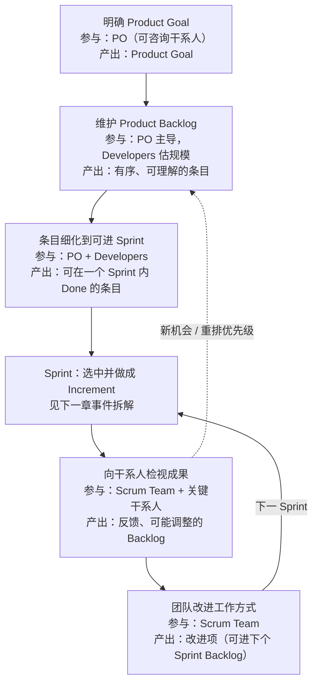
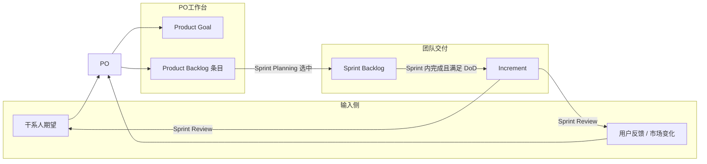

+++
title = "端到端需求流"
weight = 2
+++

从「有一个产品目标」到「持续交付可用增量」的主链路。需求不是一次性写完，而是在 Sprint 间**涌现、排序、完成、再调整**。

## 主流程

## 谁碰需求、碰出什么

## 时间节奏（经验主义）

| 节奏 | 做什么 | 避免什么 |
|------|--------|----------|
| 每个 Sprint（≤1 月） | 至少一次对 Product Goal 进展的检视与适应 | Sprint 过长导致目标失效、风险堆积 |
| 每个工作日 | Daily Scrum 对齐 Sprint Goal | 用站会替代真正协作 |
| 持续 | Backlog 细化 | 临开会才第一次看条目 |

**取消 Sprint**：仅当 Sprint Goal 过时；只有 PO 有权取消。
