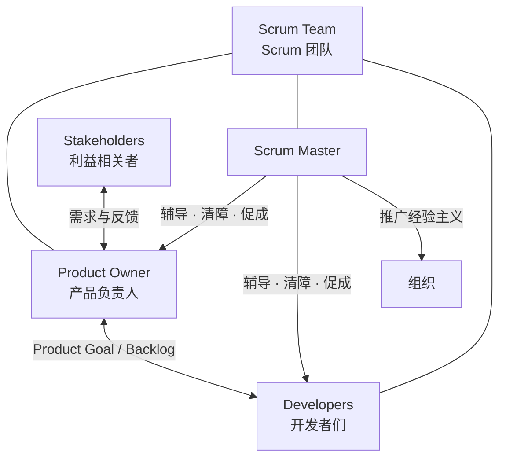

+++
title = "角色与协作"
weight = 2
+++

三种问责详见[名词介绍]()；这里只看谁和谁协作、各自产出什么。

## 产出对照

| 名词节点 | 参与 | 典型产出 |
|----------|------|----------|
| Product Owner | 一人（可代表多方需求） | Product Goal、有序 Product Backlog |
| Developers | Scrum Team 内开发者 | Sprint Backlog、符合 DoD 的 Increment |
| Scrum Master | 服务 Team 与组织 | 清障、事件有效、辅导自我管理 |

## 协作关系

节点名 = 专名（中文）。

## 边界

- **Product Owner**：可委托整理 Backlog，问责不可委托。
- **Developers**：自己决定「怎么做」；每日按 Sprint Goal 调整计划。
- **Scrum Master**：不替团队做产品决策；保证事件发生且有产出。
