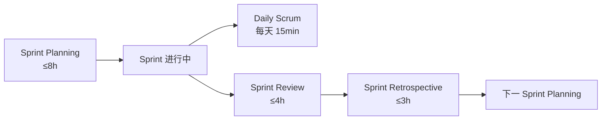
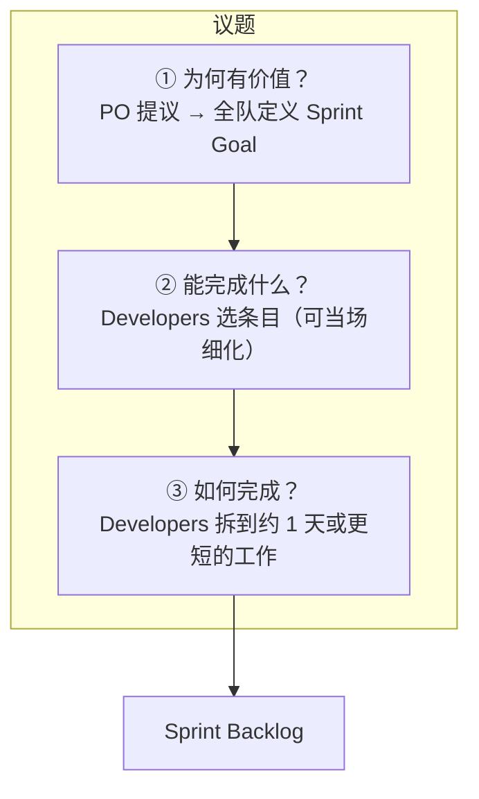
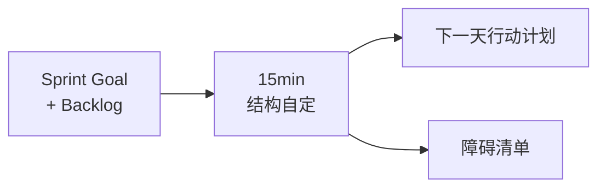
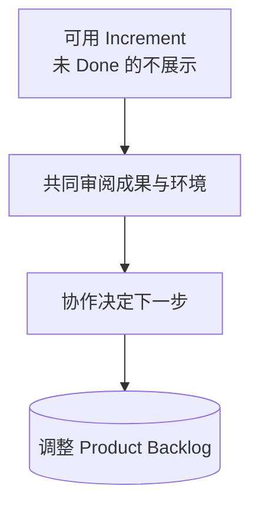
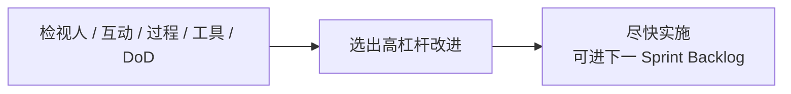
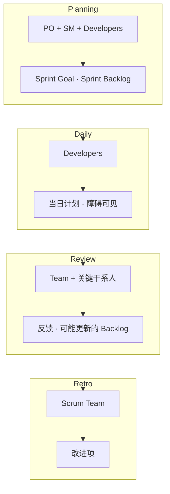

+++
title = "Sprint 事件拆解"
weight = 3
+++

Sprint 是其他事件的容器。下面按事件给出：**目的 → 参与人 → 输入 → 产出**。时间盒以「一个月 Sprint」为上限，更短则会议通常更短。

## Sprint 内顺序

---

## 1. Sprint Planning

**目的**：为即将到来的 Sprint 制定计划，并敲定 Sprint Goal。

| | |
|--|--|
| **参与** | 全体 Scrum Team；可邀请顾问 |
| **输入** | Product Goal、排好序的 Product Backlog、团队产能与过往表现、Definition of Done |
| **产出** | **Sprint Backlog** = Sprint Goal + 选中条目 + 交付计划 |

---

## 2. Daily Scrum

**目的**：检视朝向 Sprint Goal 的进展，必要时调整 Sprint Backlog 与当日计划。

| | |
|--|--|
| **参与** | **Developers**（PO/SM 若在做 Sprint 内条目，则以 Developers 身份参加） |
| **输入** | 当前 Sprint Goal、Sprint Backlog、昨日进展与障碍 |
| **产出** | **当日可执行计划**；障碍被识别（常由 SM 跟进清除） |

要点：不是唯一调整计划的时机；一天中仍可继续同步。

---

## 3. Sprint Review

**目的**：检视 Sprint 成果与环境变化，决定下一步；是**工作会议**，不是单向演示。

| | |
|--|--|
| **参与** | Scrum Team + **关键利益相关者** |
| **输入** | 本 Sprint 的 Increment（们）、Product Goal 进展、环境变化 |
| **产出** | 对「下一步做什么」的共识；**可能更新的 Product Backlog** |

Increment 可在 Sprint 结束前就交付；Review **不是**放行价值的唯一关口。

---

## 4. Sprint Retrospective

**目的**：规划如何提高质量与有效性；**结束本 Sprint**。

| | |
|--|--|
| **参与** | **全体 Scrum Team** |
| **输入** | 上个 Sprint 的人、协作、过程、工具、DoD 执行情况 |
| **产出** | **最有帮助的改进项**（影响大的尽快落地，可写入下个 Sprint Backlog） |

---

## 事件 × 参与 × 产出（总表）

