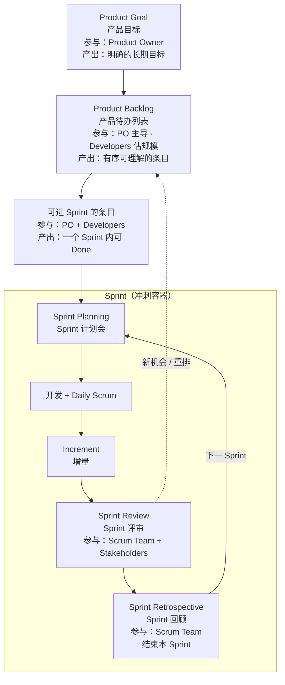
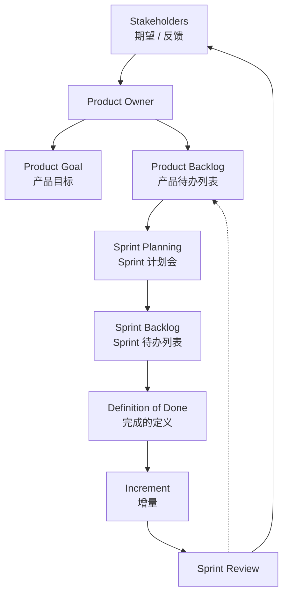

+++
title = "端到端需求流"
weight = 3
+++

从 Product Goal 到持续交付 Increment。节点均标注专名。

## 主流程

每个方框：**专名** + 谁参与 / 产出什么。  
**Sprint Review / Retrospective 都在 Sprint 内**（临近结束），不是 Sprint 结束之后。

## 需求如何变成增量

## 时间节奏

| 节奏 | 相关名词 | 避免 |
|------|----------|------|
| 每个 Sprint（≤1 月） | Product Goal 进展的检视与适应 | Sprint 过长 |
| 每个工作日 | Daily Scrum | 用站会替代协作 |
| 持续 | Product Backlog 细化 | 开会才第一次看条目 |

取消 Sprint：仅当 **Sprint Goal** 过时；只有 **Product Owner** 有权取消。
