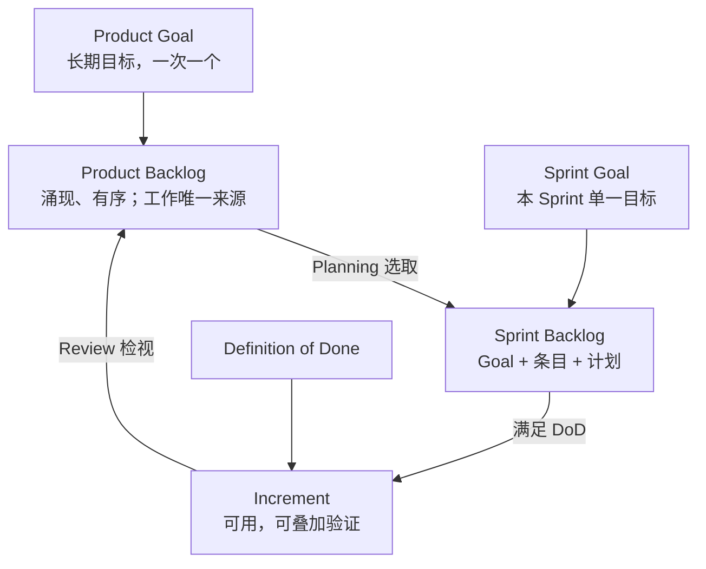
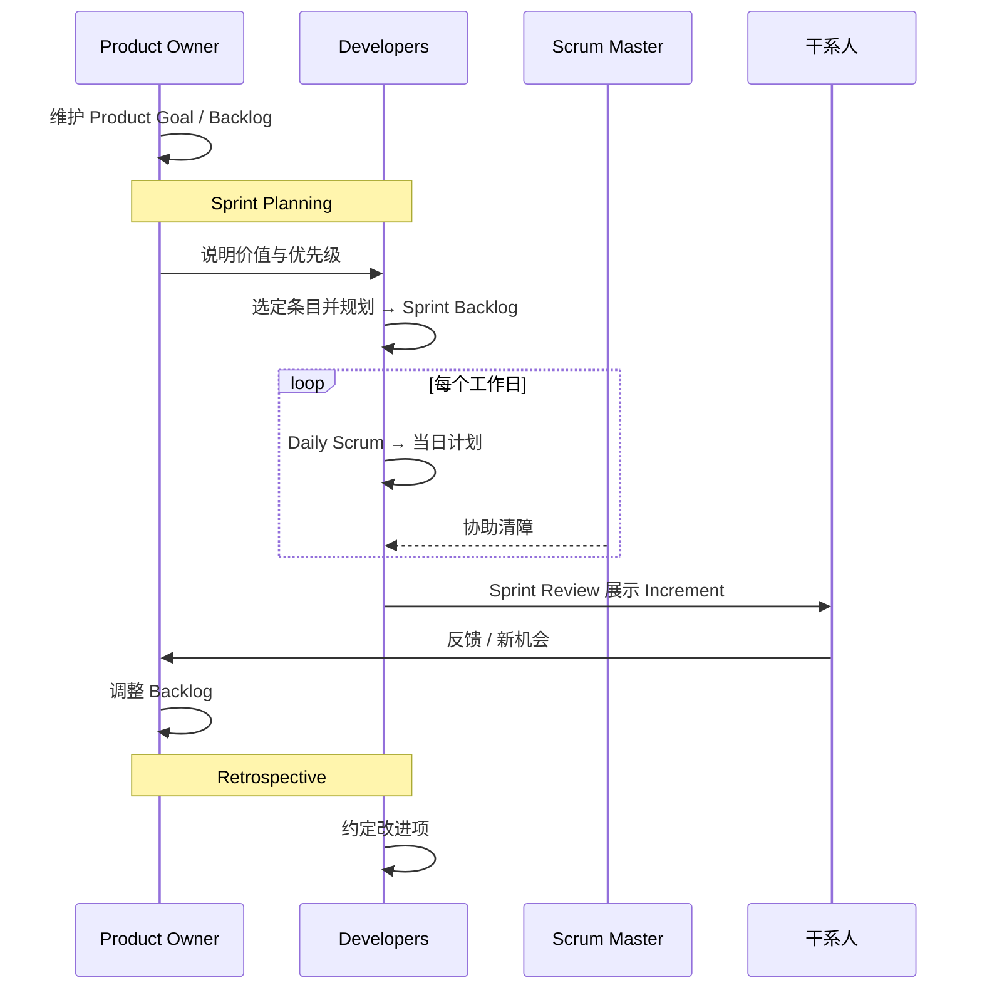

+++
title = "工件与承诺"
weight = 4
+++

三个工件各自带一个**承诺**，用来对齐透明与进度度量。

## 对照表

| 工件 | 承诺 | 主要负责人 | 回答的问题 |
|------|------|------------|------------|
| Product Backlog | **Product Goal** | PO | 产品要去向哪里？还缺什么？ |
| Sprint Backlog | **Sprint Goal** | Developers | 本 Sprint 为何有价值？做什么、怎么做？ |
| Increment | **Definition of Done** | Developers（DoD 可为组织最低标准） | 怎样才算真正完成、可交付？ |

## 工件流转

## 质量闸门：Definition of Done

- 条目不符合 DoD → **不能发布，也不能在 Review 里当完成品展示** → 退回 Product Backlog。
- 多团队做同一产品 → **共用同一 DoD**。
- 组织若已有 DoD 标准 → 团队至少遵守为下限。

## 最小闭环（可打印）

参考原文：[Scrum Guide 2020](https://scrumguides.org/scrum-guide.html)（CC BY-SA 4.0）。
