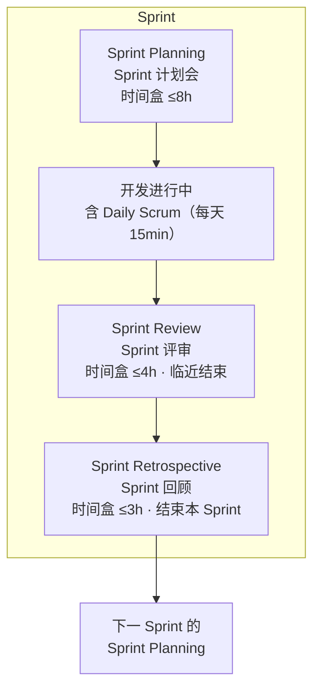
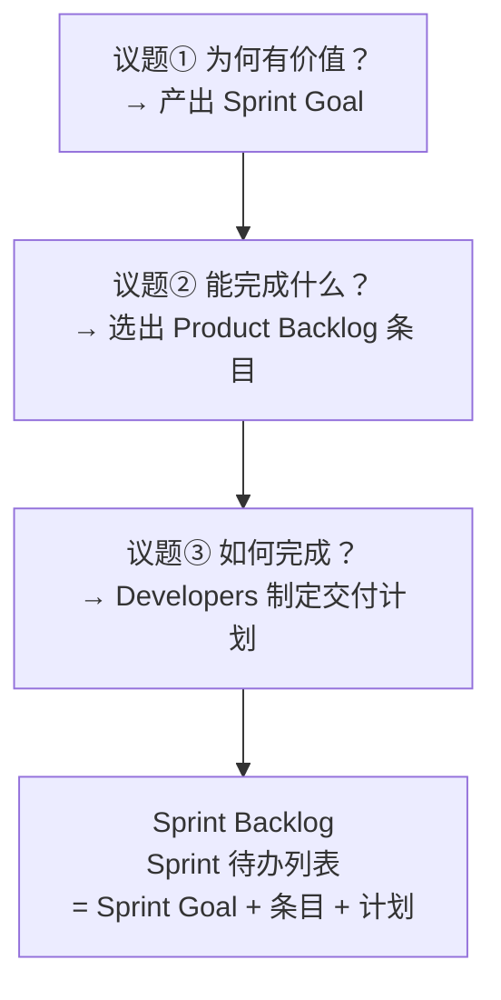
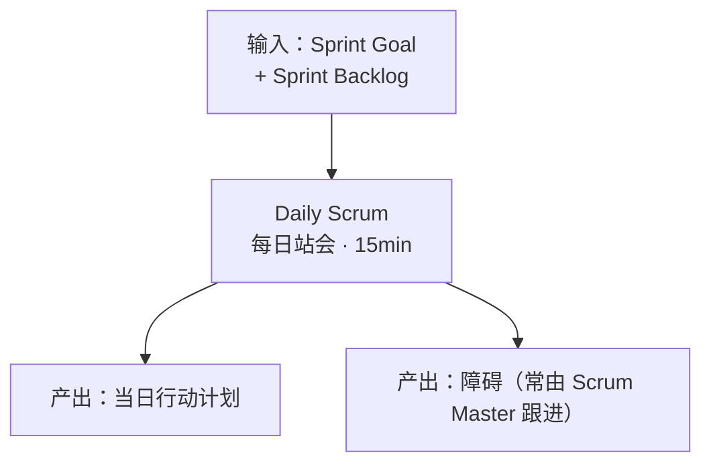
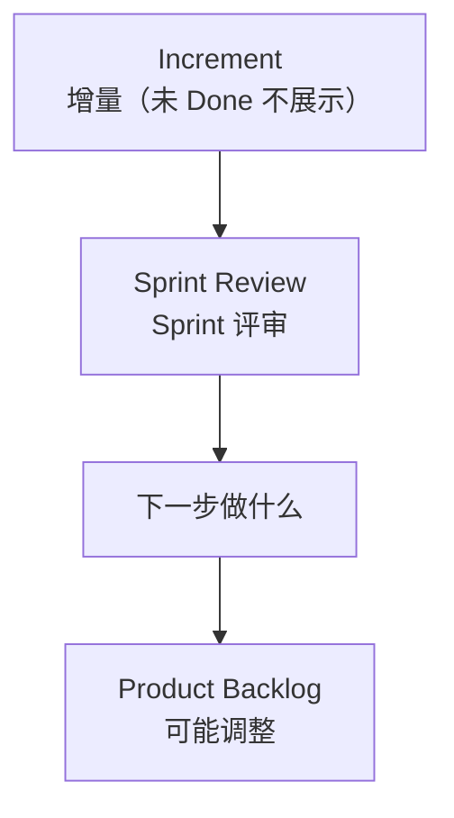
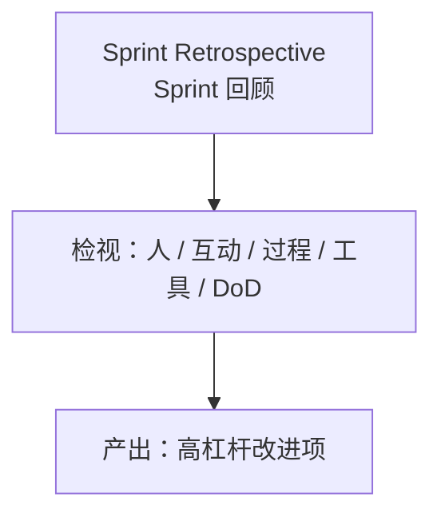
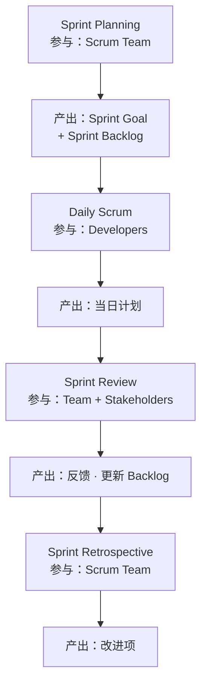

+++
title = "Sprint 事件拆解"
weight = 4
+++

Sprint 是其他事件的容器。节点均写专名；每节表格给出参与人与产出。

## Sprint 内顺序

Sprint 是容器：Planning → 开发（含 Daily）→ **Review（仍在 Sprint 内）** → **Retrospective（结束本 Sprint）**。

---

## 1. Sprint Planning

| | |
|--|--|
| **专名** | Sprint Planning |
| **参与** | Scrum Team（可邀请顾问） |
| **输入** | Product Goal、Product Backlog、产能、Definition of Done |
| **产出** | **Sprint Backlog**（含 Sprint Goal） |

---

## 2. Daily Scrum

| | |
|--|--|
| **专名** | Daily Scrum |
| **参与** | Developers（PO/SM 若在做本 Sprint 条目则以 Developers 参加） |
| **输入** | Sprint Goal、Sprint Backlog |
| **产出** | 当日计划；障碍可见 |

---

## 3. Sprint Review

| | |
|--|--|
| **专名** | Sprint Review |
| **参与** | Scrum Team + Stakeholders |
| **输入** | Increment（须满足 Definition of Done）、环境变化 |
| **产出** | 下一步共识；可能更新的 Product Backlog |

Increment 可在 Sprint 结束前交付；Sprint Review **不是**唯一放行关口。

---

## 4. Sprint Retrospective

| | |
|--|--|
| **专名** | Sprint Retrospective |
| **参与** | Scrum Team |
| **输入** | 上个 Sprint 的人、协作、过程、工具、Definition of Done |
| **产出** | 改进项（可写入下一 Sprint Backlog） |

---

## 事件 × 参与 × 产出

