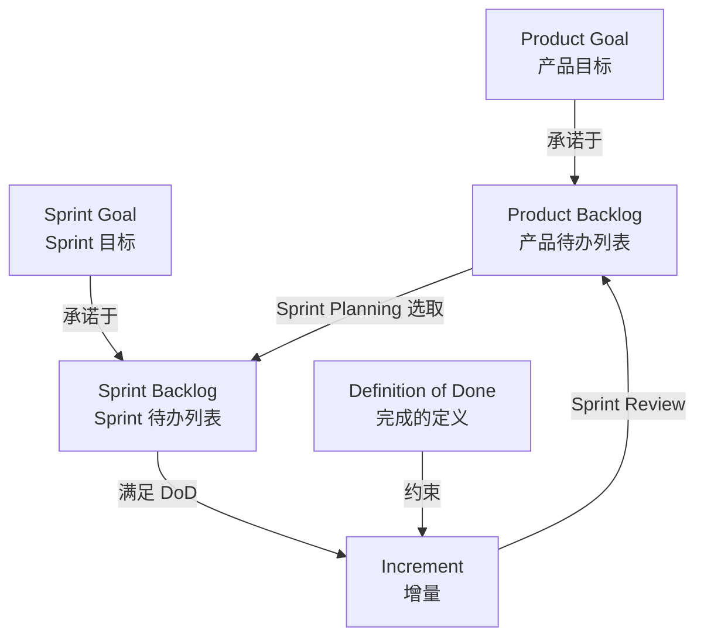
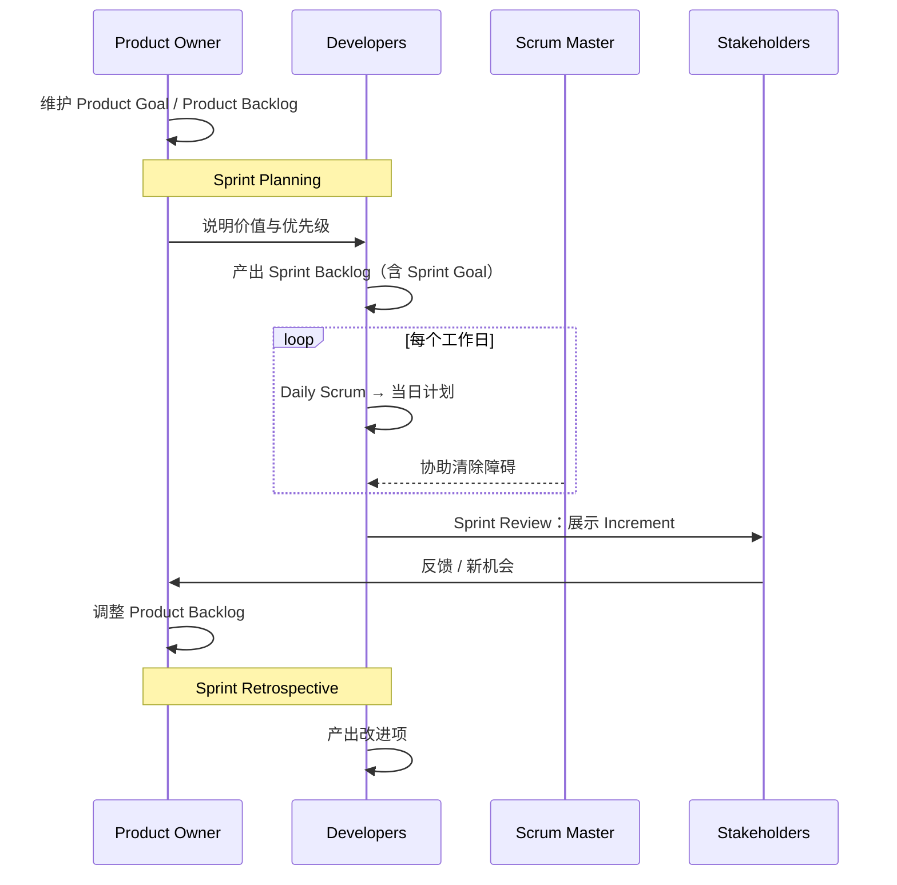

+++
title = "工件与承诺"
weight = 5
+++

三个工件各带一个承诺。专名对照见[名词介绍]()。

## 对照表

| 工件（专名） | 承诺（专名） | 负责人 | 回答的问题 |
|--------------|--------------|--------|------------|
| Product Backlog | Product Goal | Product Owner | 产品去向哪里？ |
| Sprint Backlog | Sprint Goal | Developers | 本 Sprint 为何有价值？ |
| Increment | Definition of Done | Developers | 怎样才算完成？ |

## 工件流转

## Definition of Done

- 不符合 → 不能发布，也不能在 Sprint Review 当完成品 → 退回 Product Backlog。
- 多团队同一产品 → 共用同一 Definition of Done。

## 最小闭环

