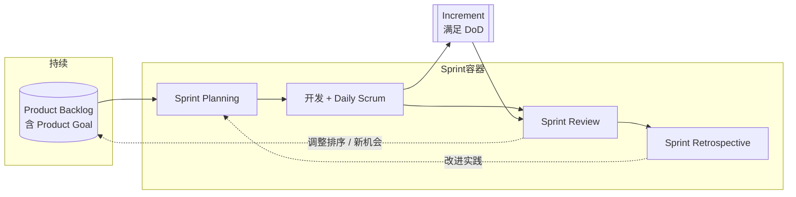

+++
title = "简介"
book_title = "Scrum 流程笔记"
glossary = ["scrum"]
+++

基于 [2020 Scrum Guide](https://scrumguides.org/scrum-guide.html) 提炼的**流程向**笔记：谁参与、做什么、产出什么。不替代官方全文。

## 一句话

Scrum Team（PO + SM + Developers）在固定长度的 **Sprint** 里，把 Product Backlog 上的需求做成可用的 **Increment**，再检视调整，循环前进。

## 总览

下一章起：角色速查 → 端到端需求流 → Sprint 内各事件（参与人 + 产出）→ 工件清单。
