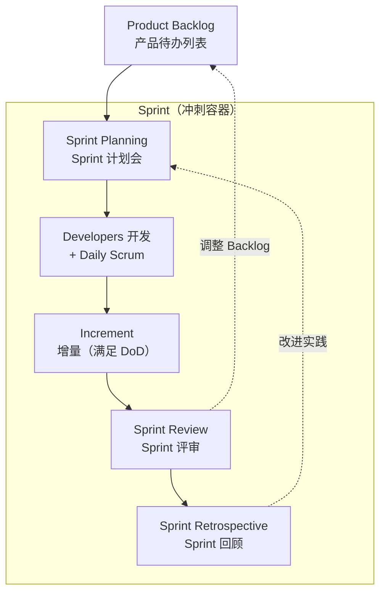

+++
title = "简介"
book_title = "Scrum 流程笔记"
glossary = ["scrum"]
+++

基于 [2020 Scrum Guide](https://scrumguides.org/scrum-guide.html) 的流程笔记：先认专名，再看谁参与、产出什么。不替代官方全文。

## 一句话

**Scrum Team** 在 **Sprint** 里，把 **Product Backlog** 做成可用的 **Increment**，再检视调整。

## 总览（节点 = 专名）

全部事件都在 **Sprint 内**：Planning 开头，Review 临近结束，**Retrospective 结束本 Sprint**（不是 Sprint 之后再评审）。

